# CARROMIA 2026 — User Manual

**For the tournament desk team: event admins, officials, check-in desk, lunch counter and umpires.**
It also covers what players and visitors see, so the desk can help them.

> Every screenshot in this manual uses **sample data**: fictional teams, players, phone numbers, UPI details and sign-in accounts. What you see on the day will have real names but look the same.

---

## Contents

1. [About CARROMIA](#1-about-carromia)
2. [Roles and permissions](#2-roles-and-permissions)
3. [The event at a glance](#3-the-event-at-a-glance)
4. [For players and visitors](#4-for-players-and-visitors)
5. [Signing in to the tournament desk](#5-signing-in-to-the-tournament-desk)
6. [Event admin guide](#6-event-admin-guide)
7. [Official guide](#7-official-guide)
8. [Check-in desk guide](#8-check-in-desk-guide)
9. [Lunch counter guide](#9-lunch-counter-guide)
10. [Umpire guide](#10-umpire-guide)
11. [The live display and public results](#11-the-live-display-and-public-results)
12. [Practice mode](#12-practice-mode)
13. [Troubleshooting and FAQ](#13-troubleshooting-and-faq)
- [Appendix A — One-time setup checklist for admins](#appendix-a--one-time-setup-checklist-for-admins)
- [Appendix B — Audit log and data](#appendix-b--audit-log-and-data)
- [Appendix C — Quick reference cards](#appendix-c--quick-reference-cards)

---

## 1. About CARROMIA

CARROMIA is the website and tournament desk for the CARROMIA 2026 parish carrom tournament. The tournament is open doubles: two players per team, on four boards, as a single-elimination knockout. The site handles:

- **Registration** of teams, singly or as a parish group, with player photos, ID details, optional UPI payment and lunch booking.
- **Registration forms (PDF)** carrying a check-in QR code and, when turned on, tear-off lunch coupons.
- **Check-in**, from the team list or by scanning the team's QR code.
- **The knockout draw**, with byes placed automatically.
- **Match control** on four boards: calling teams, timed rounds, round winners, board resets, walkovers and corrections.
- **A live display** for a TV, and **public results** for phones, both updating by themselves.
- **Desk roles** so each volunteer sees only what their job needs.

### Where it runs

| | Address | Who signs in, and how |
|---|---|---|
| **Live site** (used on the day) | `https://sajinct.github.io/carromia/` | Each person has their own **email and password**, created by an event admin |
| **Local server** (testing and training on one computer) | `http://localhost:3000` | One shared **desk password**. The local preview password is `carromia-demo` |

Both work the same way. These parts appear only on the live site: the **Officials** page, **Change password**, **practice mode**, and sign-in with your own account.

### Words used in this manual

| Term | Meaning |
|---|---|
| **Team ID** | A team's permanent number, such as `CAR-014`. IDs are never reused, even after a team is removed. |
| **Group** | Several teams from one parish registered and paid for together. The group reference is the first team's ID. |
| **Parish coordinator** | The person who registered a group. Their mobile number can download every form in the group. |
| **Pending** | A team whose UPI payment the desk has not yet confirmed. Pending teams cannot download their form, check in or enter the draw. |
| **Board** | One of the four carrom boards (Board 1 to Board 4). |
| **Match** | Two teams on a board, numbered `M01`, `M02` and so on. A match is played in **rounds**. By default it is best of 3 rounds of 10 minutes, and the first team to win 2 rounds wins the match. |
| **Called** | A match assigned to a board whose players are walking over. Its timer has not started. |
| **Reset period** | Time after a match while the board is set up again (5 minutes by default). **Board ready** ends it early. |
| **Rest period** | An optional minimum break for a team between matches. It is 0 by default. |
| **Walkover (W/O)** | A match awarded without play, for example when a team does not show up. |
| **Bye** | An empty slot in round one. The team placed against it goes straight through. |
| **Practice mode** | A separate rehearsal tournament on the live site that never touches the real event. |

---

## 2. Roles and permissions

Everyone who signs in to the desk has **one** role. An event admin picks the role on the **Officials** page (see [6.2](#62-managing-officials)).

| Role | Label in the app | In one line |
|---|---|---|
| **Event admin** | Event admin | Everything: settings, the draw, corrections, walkovers, removing teams, backups and officials. |
| **Official** | Official | Runs the day: payments, check-in, lunch, calling matches, scoring and results. |
| **Check-in desk** | Check-in desk | Checks teams in, from the list or a scanned QR code. Nothing else. |
| **Lunch counter** | Lunch counter | Serves booked lunches from the coupons. Nothing else. |
| **Umpire** | Umpire · Boards 1, 2 | Runs the matches on the boards they are given. |
| *(no sign-in)* | — | Players and visitors: public pages, registration, their own form, live boards and results. |

### 2.1 Permission matrix

✅ = allowed · 👁 = can see but not change · — = not available

| What | Public | Admin | Official | Check-in | Lunch | Umpire |
|---|:-:|:-:|:-:|:-:|:-:|:-:|
| Home, rules, teams, live boards, results | ✅ | ✅ | ✅ | ✅ | ✅ | ✅ |
| Register a team or parish group | ✅ | ✅ | ✅ | ✅ | ✅ | ✅ |
| Download own registration form (with the registered mobile) | ✅ | ✅ | ✅ | ✅ | ✅ | ✅ |
| **Match control** (all boards, queue, desk activity) | — | ✅ | ✅ | — | — | — |
| **My boards** (only the boards assigned to them) | — | — | — | — | — | ✅ |
| Assign a match to a board, or return it to the queue | — | ✅ | ✅ | — | — | — |
| Start match, mark round winner, start next round, take back a round | — | ✅ | ✅ | — | — | ✅ own boards |
| Board ready (end a reset early) | — | ✅ | ✅ | — | — | ✅ own boards |
| Team list | — | ✅ full | ✅ full | ✅ check-in view | ✅ lunch view | — |
| See mobile numbers and primary contact | — | ✅ | ✅ | — | — | — |
| See player photos and ID proof (type and last 4) | — | ✅ | ✅ | ✅ | — | — |
| See UTR and payment screenshot; **confirm payment** | — | ✅ | ✅ | — | — | — |
| Check a team in, or take a check-in back (list or QR) | — | ✅ | ✅ | ✅ | — | — |
| Serve a lunch, or undo one (list or coupon QR) | — | ✅ | ✅ | — | ✅ | — |
| Download a team's PDF or send its WhatsApp link from the desk | — | ✅ | ✅ | — | — | — |
| Bracket and Results pages, export results | — | ✅ | ✅ | — | — | — |
| **Create the knockout draw** | — | ✅ | — | — | — | — |
| **Award or undo a walkover** | — | ✅ | — | — | — | — |
| **Correct a result** | — | ✅ | — | — | — | — |
| **Remove a team** (before the draw) | — | ✅ | — | — | — | — |
| Event settings | — | ✅ | 👁 | — | — | — |
| Upload the UPI QR code | — | ✅ | — | — | — | — |
| Download backup, **reset the event** | — | ✅ | — | — | — | — |
| **Officials**: add, edit, reset password, remove *(live site)* | — | ✅ | — | — | — | — |
| Change own password *(live site)* | — | ✅ | ✅ | ✅ | ✅ | ✅ |
| Follow practice mode on a device (practice link, or the live display's switch) *(live site)* | ✅ | ✅ | ✅ | ✅ | ✅ | ✅ |
| Open practice mode from Event settings *(live site)* | — | ✅ | ✅ | — | — | — |
| Turn practice mode off or on for all devices | — | ✅ | — | — | — | — |

**In practice mode**, an Official may also try every admin action, such as the draw, walkovers, corrections and loading the sample. This is so officials can rehearse. Check-in, lunch and umpire accounts still do only their own job in practice. See [section 12](#12-practice-mode).

### 2.2 What each role sees

| Role | Menu | Team list columns |
|---|---|---|
| Admin | Match control · Teams & check-in · Tournament bracket · Results · Event settings · Officials | Team · Players (photos, ID) · Parish · Primary contact · Lunch · Check-in · Form · Remove (before the draw) |
| Official | Same as admin, without Officials | Same as admin, without Remove |
| Check-in desk | **Check-in** only | Team · Players (photos, ID) · Parish · Check-in |
| Lunch counter | **Lunch** only | Team · Players (names only) · Parish · Lunch |
| Umpire | **My boards** only | — |

If a check-in, lunch or umpire account opens any other desk address, it is taken back to its own page.

### 2.3 How the rules are enforced

The same rules are checked in three places, so a hidden button can't be worked around:

1. **The app** shows each role only its own pages, columns and buttons.
2. **The tournament rules** refuse an action the role may not do. The messages are *"Only an event admin can do this."*, *"This isn't part of the Check-in desk role."* and *"This board isn't assigned to you."*
3. **The database** (live site) checks every save against the signed-in person's role. It also locks player photos to admins, officials and check-in, and payment screenshots to admins and officials. Officials can be managed only through a server function that checks the caller is an admin. An admin can't remove themselves or drop their own admin role.

> **Known limit (live site):** the desk applies the rules in the browser. So check-in, lunch and umpire accounts still *download* the event's private data, including mobile numbers, the last 4 of each ID and payment references, even though the app never shows it to them. Photos and payment screenshots stay locked by the database. Give these roles only to people you trust with that data.

When an admin changes someone's role or boards, it takes effect the next time that person's desk refreshes. They do not need to sign out.

---

## 3. The event at a glance

```mermaid
flowchart LR
  A[Admin sets up<br/>Event settings] --> B[Teams register<br/>online]
  B -->|UPI payment on| C{Payment<br/>confirmed?}
  C -- not yet --> C1[Pending:<br/>no form, no check-in]
  C1 -->|Desk confirms| D
  C -- no payment needed --> D[Team confirmed:<br/>downloads PDF form]
  D --> E[Match day:<br/>check-in at the desk]
  E --> F[Admin creates<br/>knockout draw]
  F --> G[Desk assigns<br/>match to board]
  G --> H[Umpire / official<br/>starts match]
  H --> I[Round winners<br/>marked]
  I -->|first to win<br/>most rounds| J[Winner advances,<br/>board resets]
  J -->|Board ready| G
  J --> K[Final → Champions]
```

**Suggested timetable on the day** (from the published schedule): registration 10:00 AM · inauguration 10:30 · matches start 11:00 · lunch 1:30 PM · quarterfinals 2:30 · finals 4:30 · awards 5:30.

| When | Who | What |
|---|---|---|
| Weeks before | Admin | Settings, UPI, lunch coupons, contacts; add the officials; rehearse in practice mode |
| While registration is open | Officials | Confirm payments; send forms on WhatsApp |
| Registration closes | Admin | Check the team list; remove duplicates; untick *Registration open* if needed |
| Morning of the event | Check-in desk | Scan QR codes; compare faces, IDs and the attested forms |
| After check-in | Admin | **Create knockout draw** |
| All day | Officials and umpires | Assign, start, score, board ready; the lunch counter serves lunches |
| After the final | Admin | Export results; download a backup |

---

## 4. For players and visitors

No sign-in is needed for anything in this section.

### 4.1 Home page

The home page shows the date, the venue with directions, the prizes, the entry fee, how many team slots are left, the registration deadline, the day's timetable, Mass times, what to bring, and the hosts. The main button reads **Register your team** while registration is open. It changes to **Follow the tournament** once registration closes.

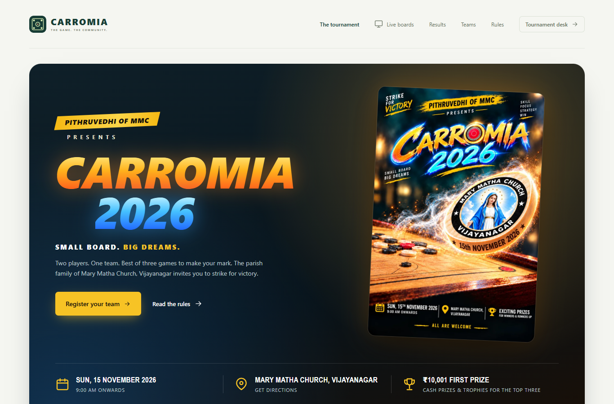

On a phone the links move into the **☰ menu** at the top right. The menu also has **Register your team** while registration is open.

| Home on a phone | Menu |
|---|---|
| 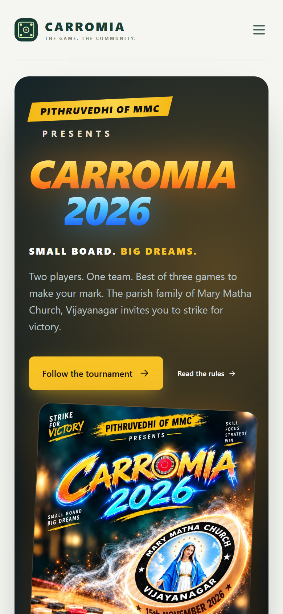 | 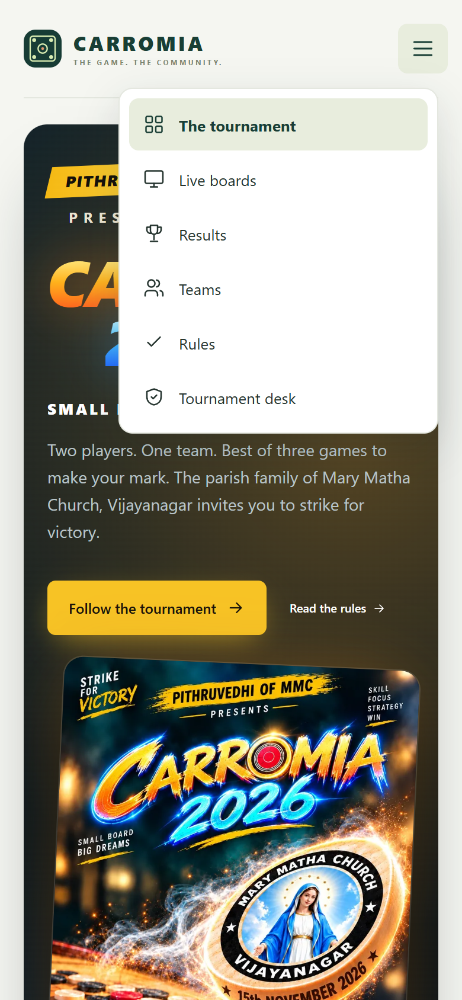 |

### 4.2 Rules

**Rules** lists the numbered tournament rules, the documents to bring, and "Good to know" notes (entry fee, deadline, reporting time, lunch).

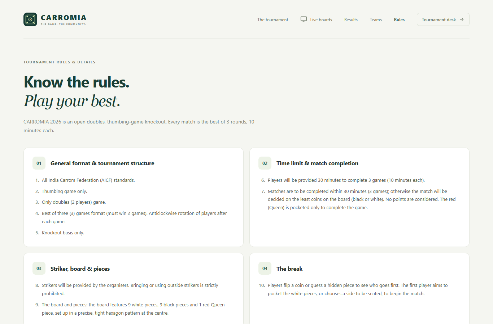

### 4.3 Registering one team

1. Open **Register your team**.
2. Choose the **Forane / Zone**, then the **Parish / Centre**. The list is the diocese register.
3. Enter the **Team name**.
4. For **each of the two players**, enter:
   - a **photo** (required; any phone photo — it is resized automatically),
   - their **full name**,
   - their **mobile number**,
   - the **ID proof** type (Aadhaar, Voter ID, Driving Licence, Passport, Other),
   - the **last 4 characters** of that ID's number.
5. Choose the **Primary contact** (player one or two). Their mobile number is the one that can download the form later.
6. Choose **Lunch on the day**: none, 1 player or both players. Lunch is provided only if it is booked here.
7. Tick **Both players are 18 or older**, then press **Register team**.

| Empty form | Filled form |
|---|---|
| 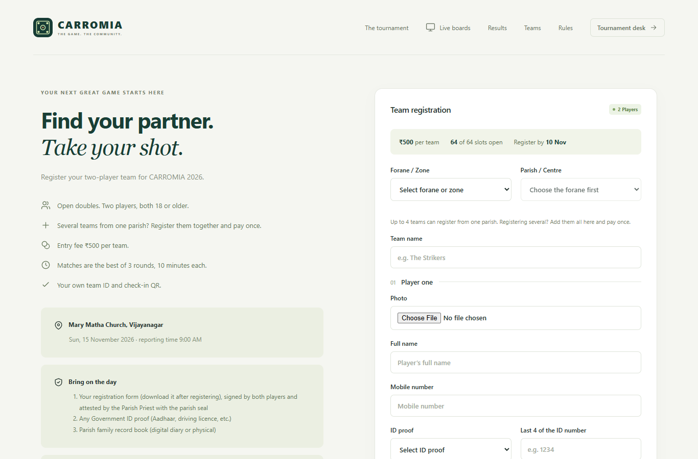 | 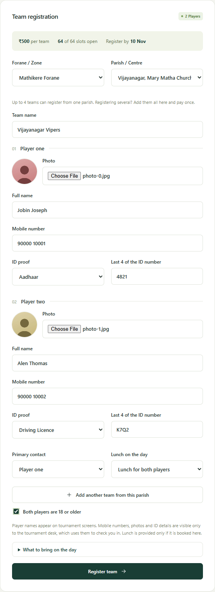 |

On a phone, the page opens with the event details, and the form follows below:

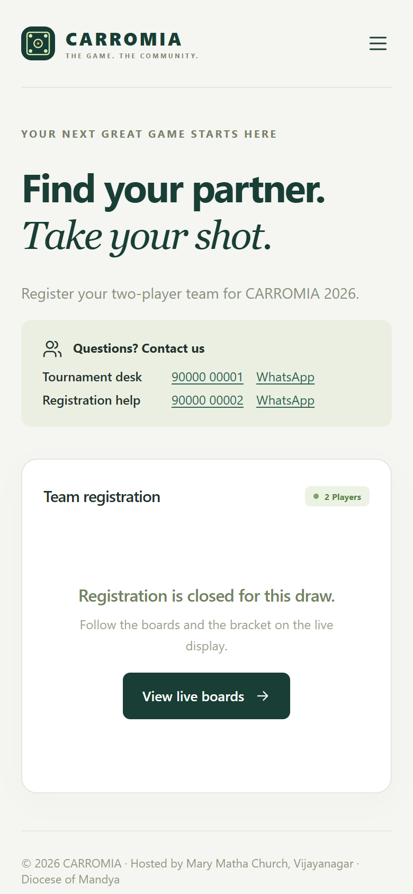

**After registering** (when no payment is collected), the team gets its **team ID** and **check-in QR code** straight away. Two buttons follow:

- **Download registration form (PDF)**
- **Save QR code**

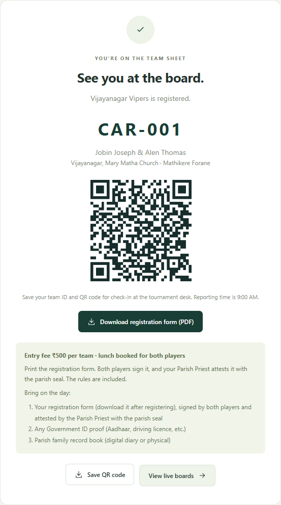

**Limits the form enforces:**

- 64 team slots by default.
- Up to 4 teams per parish by default. Names like "St. Thomas" and "St Thomas Church" count as the same parish.
- Team names must be unique.
- The registration deadline is the end of that day, India time.
- Registration closes when the draw is created.

When registration is closed, the form is replaced by the reason, for example *"Registration closed on 10 November 2026."*

### 4.4 Registering several teams from one parish (group)

1. Fill in the first team as above.
2. Press **Add another team from this parish**. You can add up to 8 teams, within the parish's remaining limit and the slots left.
3. Once there are two or more teams, fill in the **Parish coordinator** (name and mobile). The coordinator's number can download every team's form, and the desk contacts them about payment.
4. Tick **All players are 18 or older**, then press **Register N teams**.

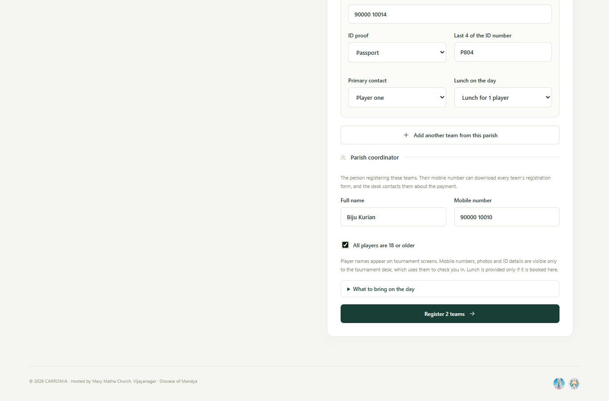

Each team still gets its own ID, QR code and place in the draw. The confirmation shows the **group reference** (the first team's ID) and a **Download all N forms (PDF)** button.

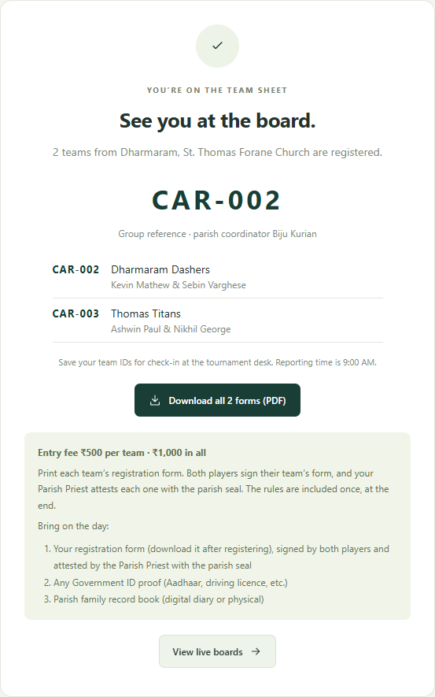

### 4.5 Paying the entry fee by UPI (when turned on)

If the admin has turned on **Collect the entry fee by UPI**, the form shows a **Payment** section. It holds:

- the UPI QR code,
- the UPI ID with **Copy UPI ID**,
- on phones, a **Pay with a UPI app** button with the amount filled in. For a group, the amount is the fee × the number of teams.

1. Pay using the QR code or the button.
2. Enter the **UPI transaction number (UTR)** (6–30 letters or digits), **or** add a **payment screenshot**, or both.
3. Submit.

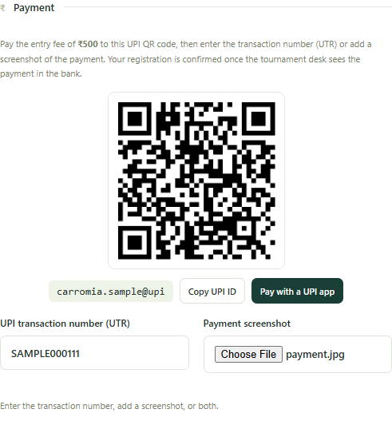

The registration is then **pending**. The team gets its ID, but the form download waits until the desk sees the money arrive in the bank and confirms it. The desk then sends the form link on WhatsApp. The team can also download the form from the **Teams** page.

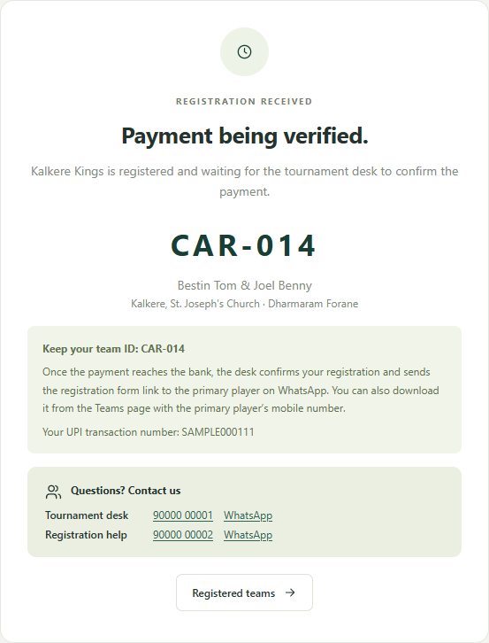

### 4.6 The registration form (PDF)

Print the form. **Both players sign it**, and the **Parish Priest attests it with the parish seal**. Bring it on the day with a government ID proof and the parish family record book.

The form contains:

- the team ID and the **check-in QR code**,
- parish and player details with photos,
- the declaration and the Parish Priest's attestation,
- an "office use" box,
- the rule book.

When lunch coupons are turned on, it also has **tear-off lunch coupons**, one per booked lunch, each with its own QR code.

| Registration form, page 1 | With lunch coupons (payment confirmed) |
|---|---|
| 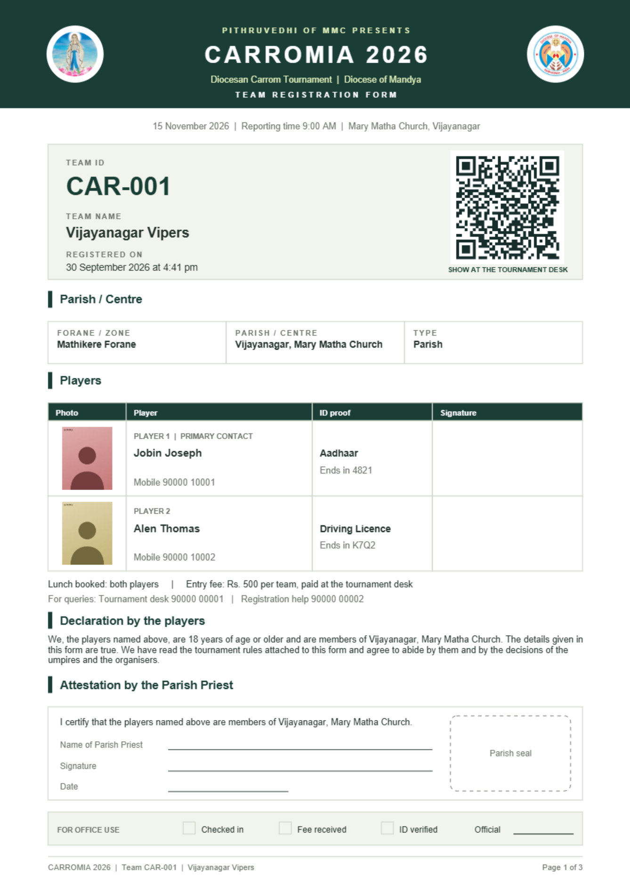 | 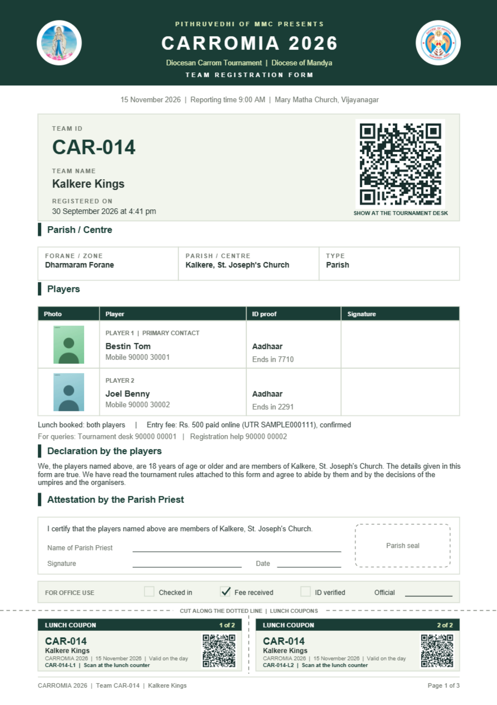 |

The rules pages follow:

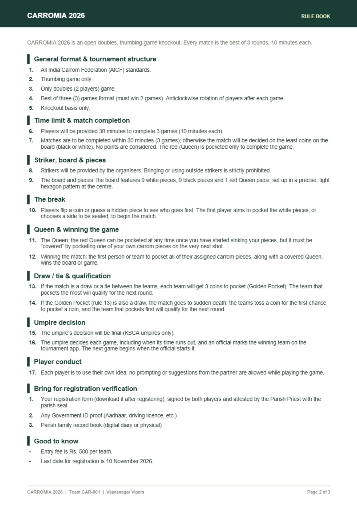

### 4.7 Downloading the form again (Teams page)

**Teams** lists every confirmed team (pending teams are hidden), with a search box. To download a form:

1. Tap the team's **Registration form**.
2. Enter the **primary player's mobile number**. For a group, the parish coordinator's number also works.
3. Tick **All N teams … in one PDF** to download the whole group at once.

The WhatsApp link the desk sends opens this box directly. After too many wrong numbers, the site asks you to wait before trying again: 10 wrong tries per hour on the live site.

| Teams page | Download dialog (group) |
|---|---|
| 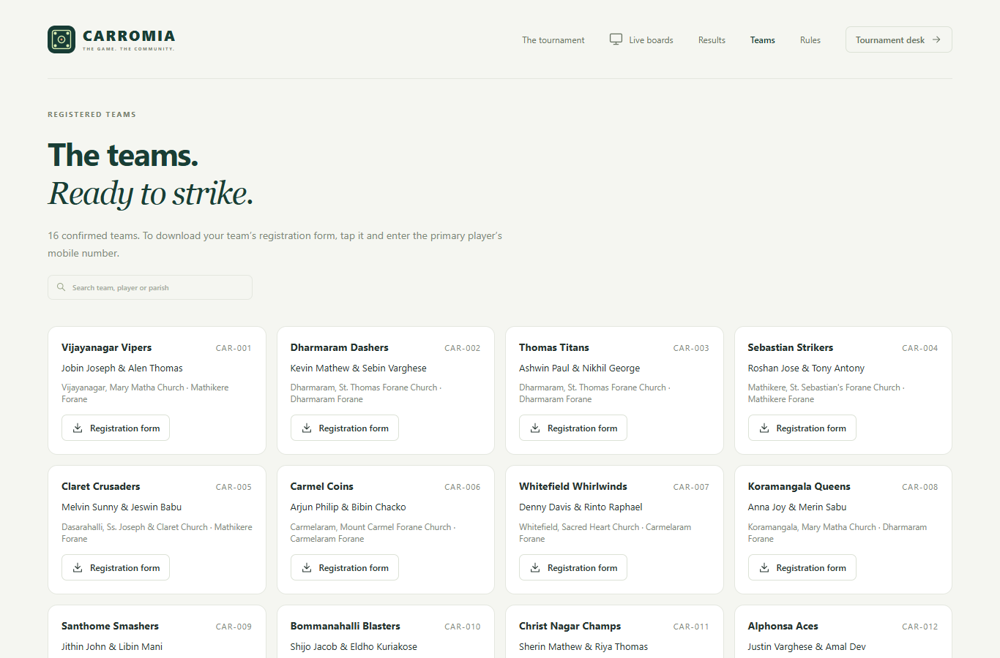 | 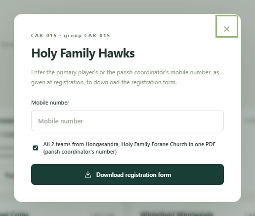 |

### 4.8 Following the tournament

**Live boards** (`/live`) is the big-screen view described in [section 11](#11-the-live-display-and-public-results). **Results** is made for phones. It shows:

- the champions,
- "On the boards now",
- every result by round, which you can search for your team,
- the bracket.

It updates by itself.

| Results on a phone | Results with champions |
|---|---|
| 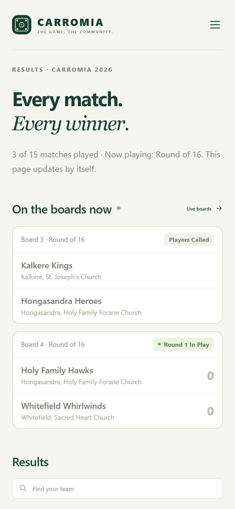 | 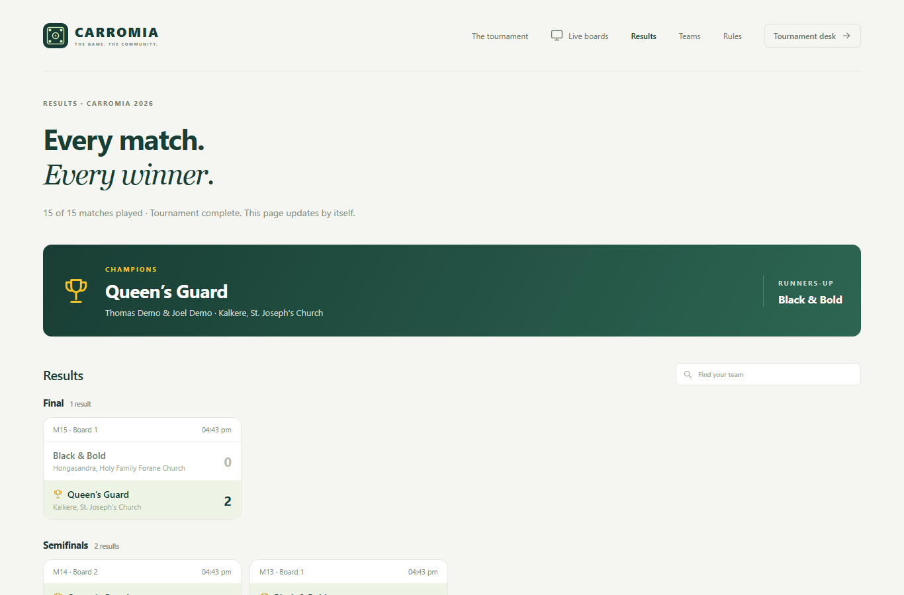 |

---

## 5. Signing in to the tournament desk

1. Open **Tournament desk**, at the top right of any public page, or go to `/admin` (`#/admin` on the live site).
2. **Live site:** enter your **email** and **password**. **Local server:** enter the **desk password**.
3. Press **Open tournament desk**.

| Live site (email and password) | Local server (desk password) |
|---|---|
| 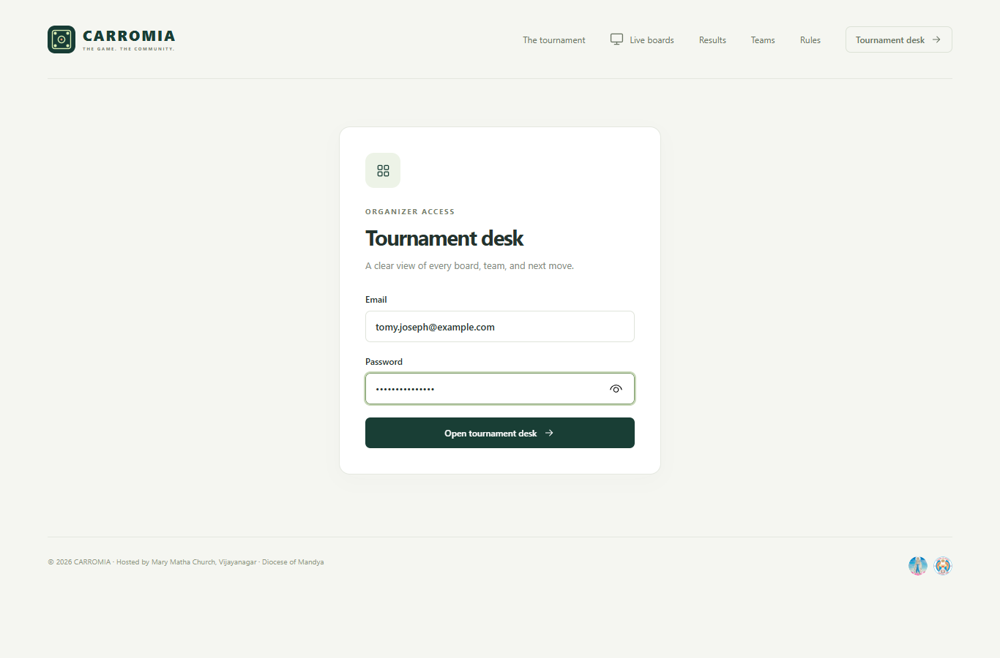 | 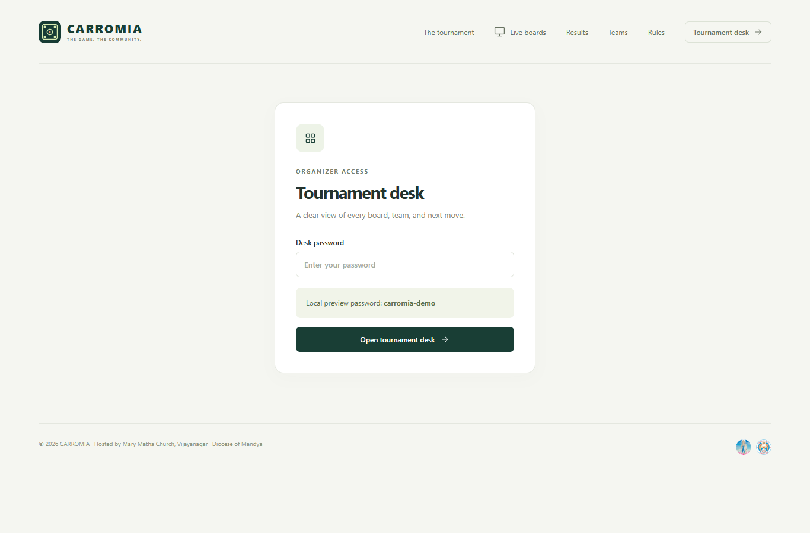 |

### 5.1 Your account and password (live site)

Tap your **initials** at the top right to see your name and role. From there you can **Change password** (at least 8 characters; you stay signed in) or **Sign out**. **Change password** is also in the sidebar. If you forget your password, ask an admin to reset it ([6.2](#62-managing-officials)).

| Account | Change password |
|---|---|
| 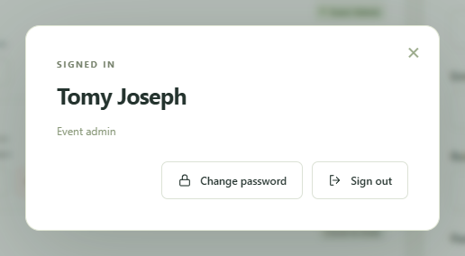 | 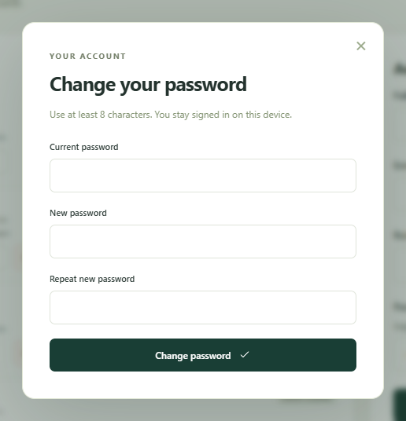 |

### 5.2 The desk on a phone

On a phone, the pages you use all day (**Matches, Teams, Bracket, Results**) sit in a bar at the bottom. Everything else is in the **☰ menu**: Event settings, Officials, Open live display, Change password and Sign out. The menu also shows who is signed in and their role.

| Match control | Menu | Teams |
|---|---|---|
| 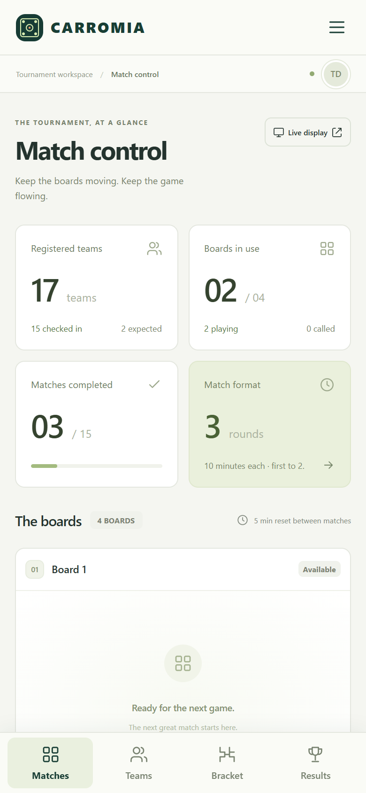 | 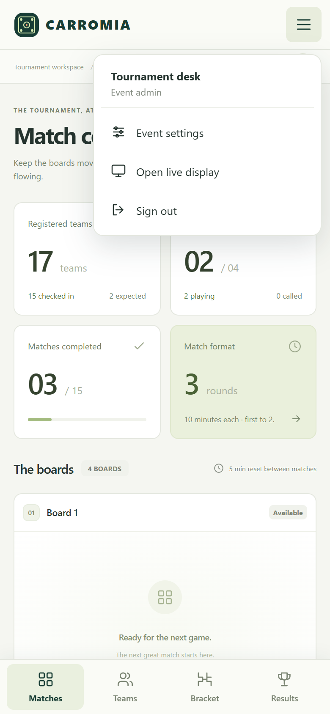 | 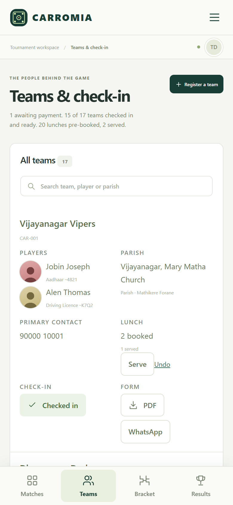 |

The **Live updates connected** dot at the top means the screen is up to date. *Reconnecting — data may be outdated* means the connection dropped. The desk keeps retrying by itself.

---

## 6. Event admin guide

*Everything in this section needs the **Event admin** role, unless it says otherwise.*

### 6.1 Event settings

Open **Event settings**. Officials can open the page, but only an admin can save it.

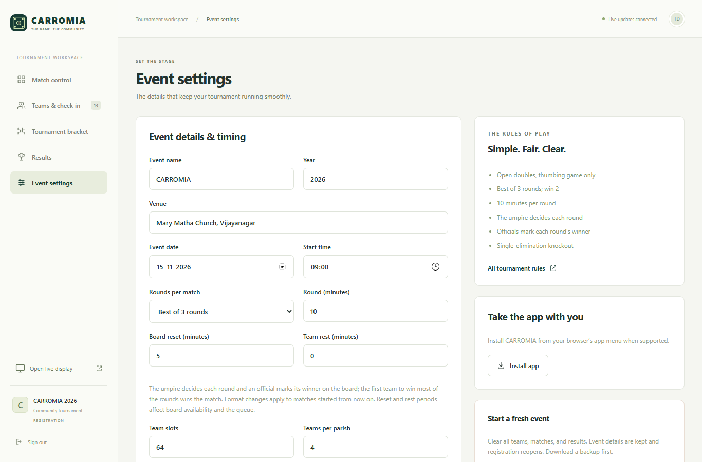

| Setting | What it does |
|---|---|
| Event name, year, venue, date, start time | Shown on the home page, the live display and the forms. |
| **Rounds per match** (1, best of 3, best of 5) and **Round (minutes)** (1–30) | The match format. A match keeps the format it started with, so changes apply only to matches started afterwards. |
| **Board reset** (0–30 min) | How long a board stays "resetting" after a match. |
| **Team rest** (0–60 min) | The minimum break before a team's next match. Walkovers and byes don't count. |
| **Team slots** (2–128), **Teams per parish** | Registration limits. |
| **Registration deadline**, **Entry fee per team** | Registration closes at the end of the deadline day. The deadline doesn't apply in practice mode. |
| **Registration open** | Untick to close registration by hand. It locks once the draw is created. |
| **Payment** | See below. |
| **Lunch** | See below. |
| **Support** | Up to 3 contacts (name and phone). They appear on the registration page (with call and WhatsApp links) and on every form. |

Press **Save settings** at the bottom.

**Collecting the entry fee by UPI**

1. Tick **Collect the entry fee by UPI at registration**.
2. Under **UPI QR code**, choose a picture of your UPI QR code (PNG or JPEG). It uploads straight away; *"QR code uploaded. Save settings to use it."*
3. Optionally enter the **UPI ID**, such as `name@bank`. This adds the **Pay with a UPI app** button on phones.
   Optionally enter the **UPI payee name**, such as `MARY MATHA CHURCH TRUST`. It is the name the UPI app shows when paying; left blank, the event name and year are used.
   Enter a **Merchant category code** only if the UPI ID is a merchant account your bank has onboarded for UPI payments (the bank gives you the 4-digit code). Payments then also carry the merchant category and a transaction reference for each registration. Leave it blank for a personal or trust savings UPI ID, or UPI apps may decline the payment.
   Tick **Hide the Pay with a UPI app button** if UPI apps decline payments started from it. Teams then pay by scanning the QR code or copying the UPI ID.
4. **Save settings.** New registrations are then *pending* until an official confirms the payment ([7.1](#71-teams-payments-and-forms)).

**Lunch coupons:** tick **Print lunch coupons on the registration form and scan them at the lunch counter**. Each booked lunch gets a tear-off coupon with a QR code, and each coupon can be served once. Turn this on **before** teams download their forms.

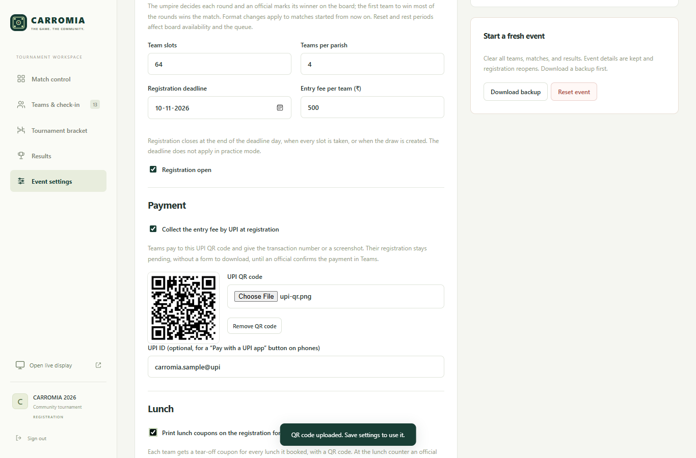

Full settings page

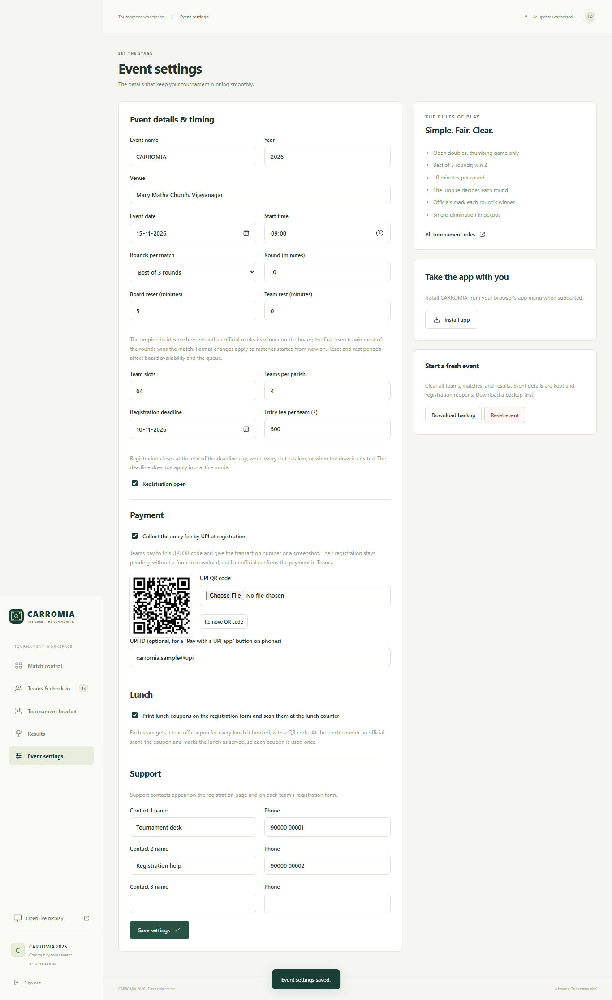

### 6.2 Managing officials

*Live site only. Also possible from the command line; see [Appendix A](#appendix-a--one-time-setup-checklist-for-admins).*

Open **Officials**. The list shows each person's name, email, role (umpires with their boards) and last sign-in.

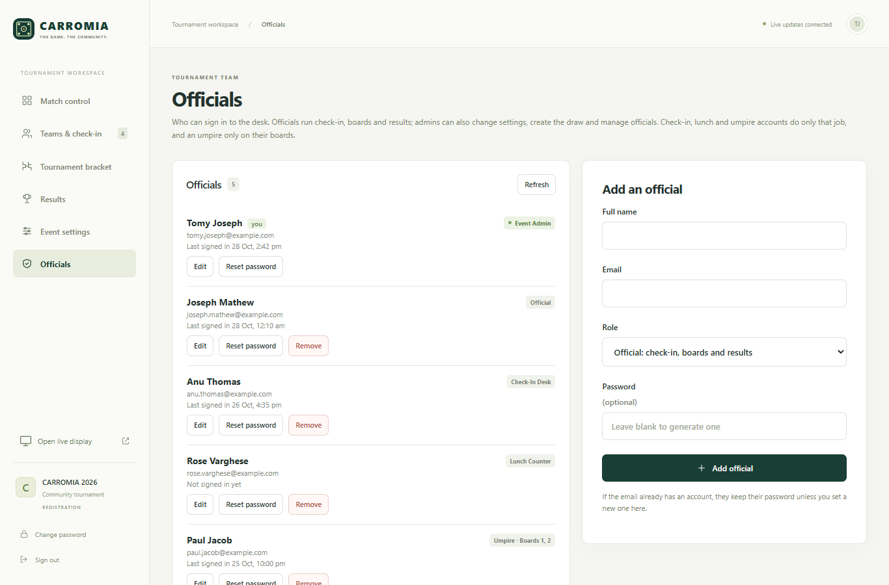

**Add an official**

1. Enter their **full name** and **email**.
2. Choose the **Role**:
   - *Official: check-in, boards and results*
   - *Admin: also settings, draw and officials*
   - *Check-in desk: checks teams in, nothing else*
   - *Lunch counter: serves booked lunches, nothing else*
   - *Umpire: runs the matches on their boards*
3. For an **Umpire**, tick their boards (at least one, from 1 to 4).
4. Optionally type a **Password** (at least 8 characters). If you leave it blank, one is generated.
5. Press **Add official**. The sign-in details are shown **once**. Use **Copy details** and send them privately.

If the email already has an account, the person keeps their password unless you set a new one here.

| Adding an umpire for boards 3 and 4 | Sign-in details, shown once |
|---|---|
| 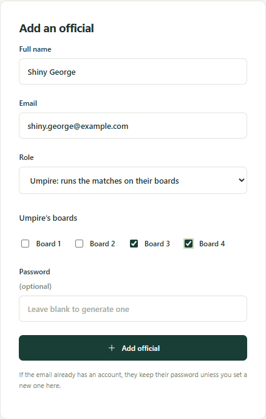 | 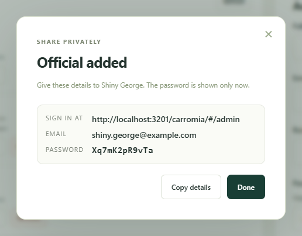 |

**Edit** changes someone's name, role or umpire boards. You can't change your own role.
**Reset password** makes a new temporary password, shown once, and their old one stops working.
**Remove** deletes the account and signs them out. Their past actions stay in the audit log. You can't remove yourself.

| Edit | Reset password | Remove |
|---|---|---|
| 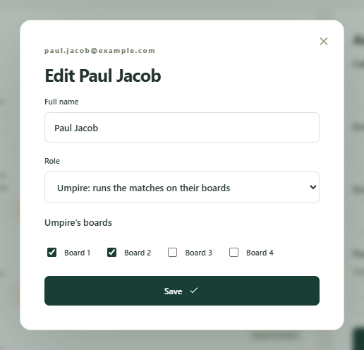 | 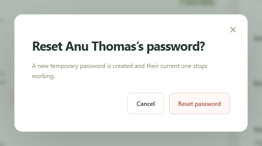 | 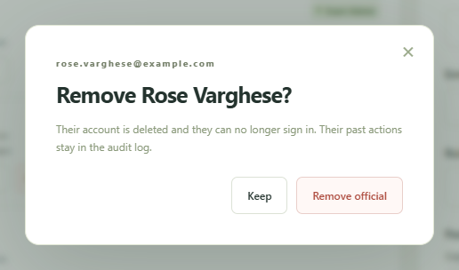 |

### 6.3 Confirming payments and removing teams

Confirming payments is also open to officials: see [7.1](#71-teams-payments-and-forms).

**Remove a team** (admins, before the draw only): in **Teams & check-in**, press **Remove** on the team's row, then **Remove team**. This deletes the team and its players' details, and the team ID is never reused. Use it for duplicates and withdrawals. After the draw, teams can't be removed. Use a **walkover** instead.

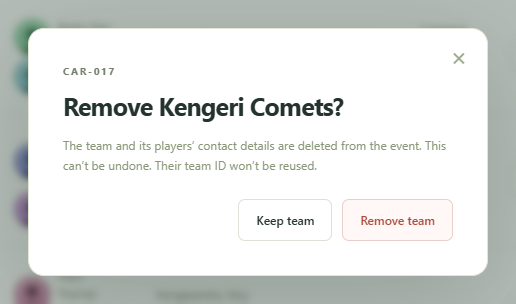

### 6.4 Creating the knockout draw

When check-in is done (or nearly done):

1. Go to **Match control** or **Tournament bracket** and press **Create knockout draw**.
2. Read the dialog. It shows how many **confirmed** teams will be placed and how many **awaiting payment** will be **left out**. Confirm those payments first if they should play.
3. Press **Create draw for N teams**.

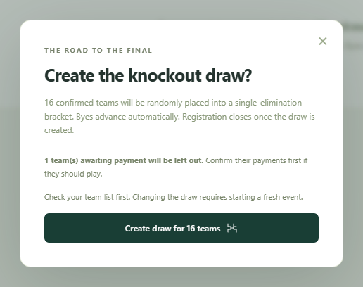

The teams are shuffled into a single-elimination bracket. Byes are added automatically when the number isn't a power of two. The rounds are named *Round of 16*, *Quarterfinals*, *Semifinals* and *Final*. **Registration closes.** The draw can't be changed afterwards, except by starting a fresh event.

| Before the draw | After the draw |
|---|---|
| 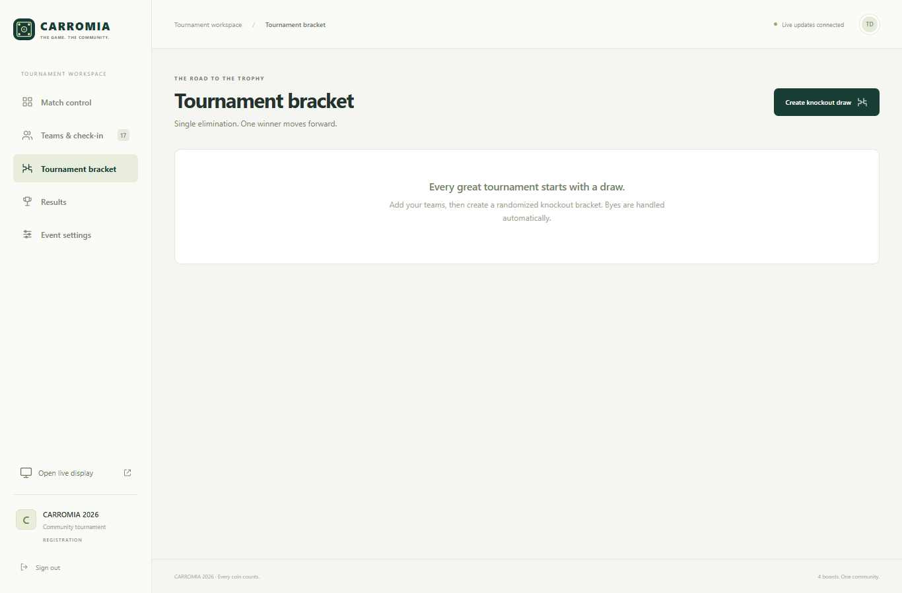 | 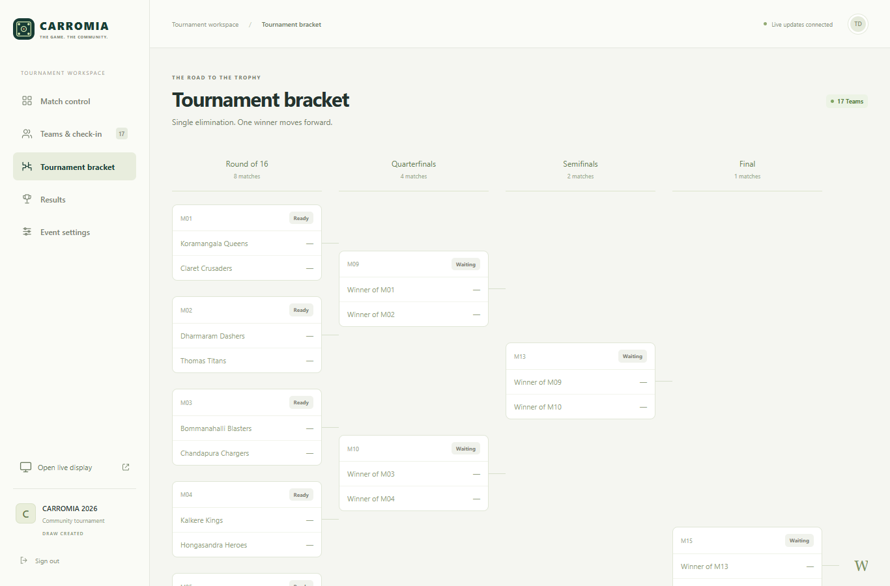 |

### 6.5 Walkovers

When a team doesn't show up or withdraws after the draw:

1. In **Match control → Match queue**, press **Walkover** on that match. It must not have started yet.
2. Choose the **team that advances**, and enter a **reason** (the default is "Opponent did not show").
3. Press **Award walkover**.

The match is completed without play. The winner needs neither check-in nor rest, and the later rounds update.

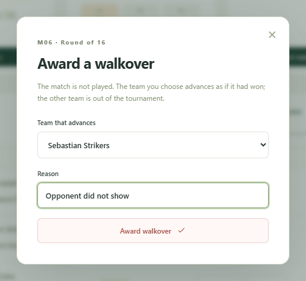

**Undo walkover** is in **Results**. It puts the match back in the queue, as long as the next round's match hasn't been called yet.

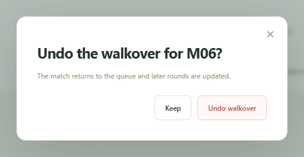

### 6.6 Correcting a result

If a result was entered wrongly and the match has already ended:

1. Open **Results** and press **Correct** on the match.
2. Choose the winner of each round, in order, up to the round that decided the match. Leave later rounds as *Not played*.
3. Press **Save corrected result**.

The winner is worked out again, later rounds are updated, and the result is marked *Corrected*. This is only possible **until the winner's next match is called**.

While a match is still being played, use **↩ Take back** on the board instead ([7.3](#73-running-a-match)).

| Results (admin view) | Correct the result |
|---|---|
| 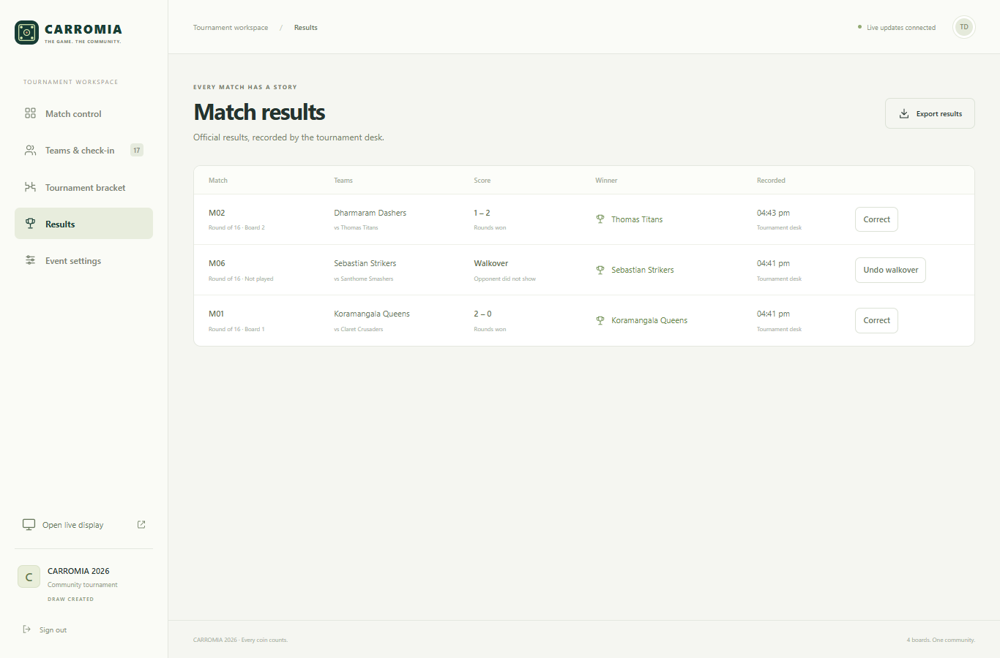 | 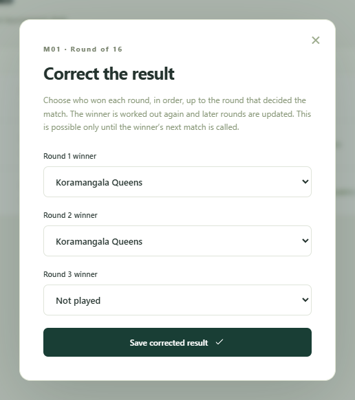 |

### 6.7 Backup, fresh event and the sample tournament

**Event settings → Start a fresh event** has two buttons:

- **Download backup** saves the whole event as a JSON file, including contact details. Keep it private.
- **Reset event** clears all teams, matches and results, keeps the settings and reopens registration. Type `RESET` to confirm.

| Start a fresh event | Reset confirmation |
|---|---|
| 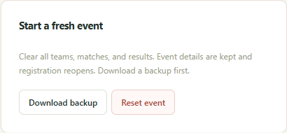 | 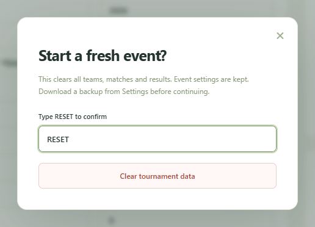 |

**Sample tournament.** On an empty event, the desk offers a way to try things out. On the **local server** this is **Load sample tournament**: 16 fictional teams, all checked in, with the draw made and four matches called. A "SAMPLE TOURNAMENT" strip is shown, and public registration stays closed until you start a fresh event.

On the **live site**, the sample tournament lives in **practice mode** only ([section 12](#12-practice-mode)).

| Empty desk | Sample tournament loaded |
|---|---|
| 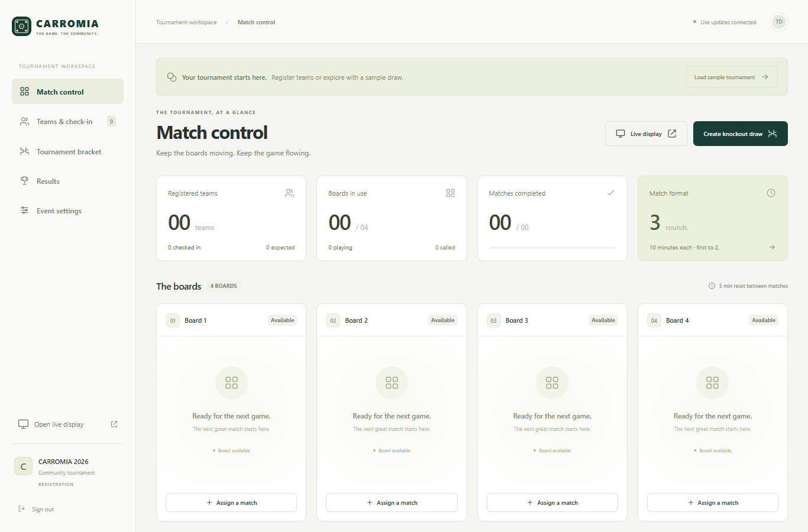 | 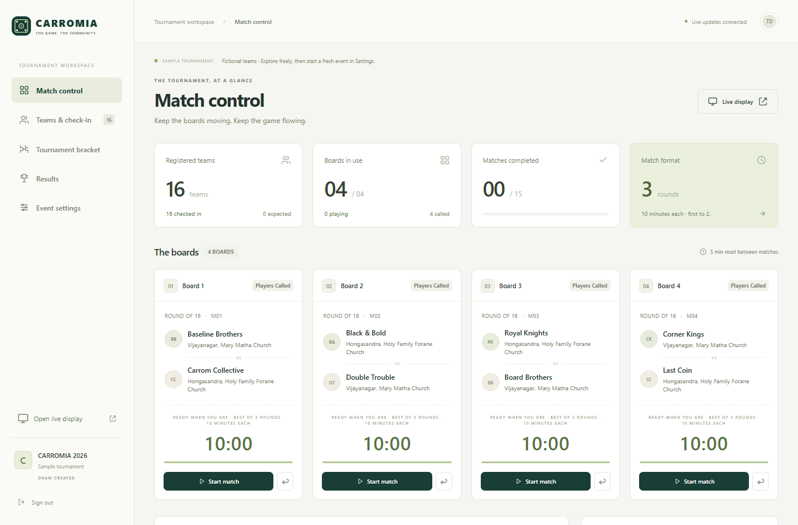 |

---

## 7. Official guide

*For **Officials** and **Admins**.*

### 7.1 Teams, payments and forms

**Teams & check-in** lists every team with its players (photo, name, ID type and last 4), parish, primary contact, lunch, check-in and form. The heading sums up how many teams are awaiting payment, checked in, and lunches booked and served. Search by team name, ID, player, parish, or group.

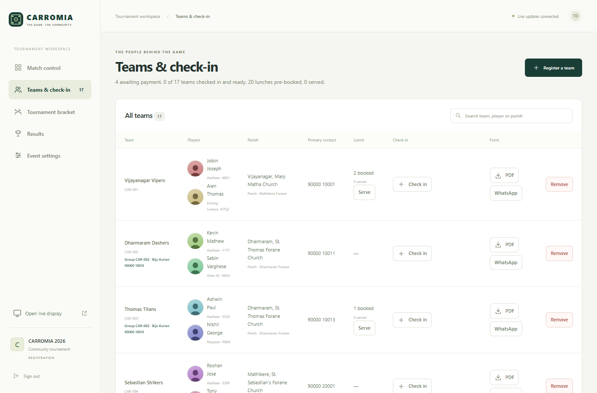

**Pending teams** show an orange *Awaiting payment* label and a **Confirm payment** button, with the UTR and **View screenshot** if they gave one. A group shows its total and the number of teams.

| A pending parish group | A pending team with UTR and screenshot |
|---|---|
| 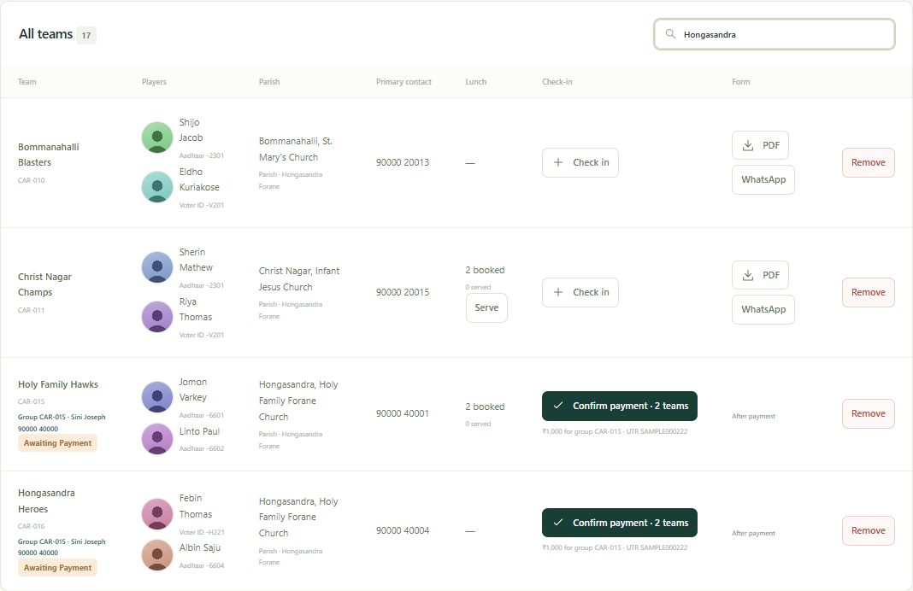 | 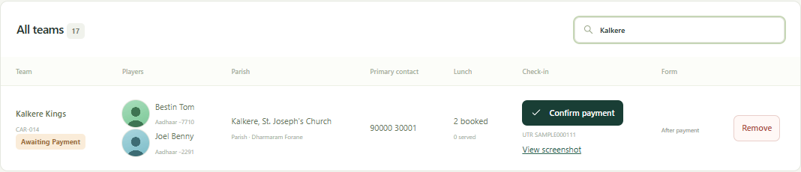 |

**To confirm a payment:**

1. Check the bank or UPI statement for the UTR and the amount. **View screenshot** shows what the team uploaded.
2. Press **Confirm payment**, then **Payment received**. **Not yet** leaves it pending.
3. A group is confirmed **together** in one step.

| Payment screenshot | Confirm one team | Confirm a group |
|---|---|---|
| 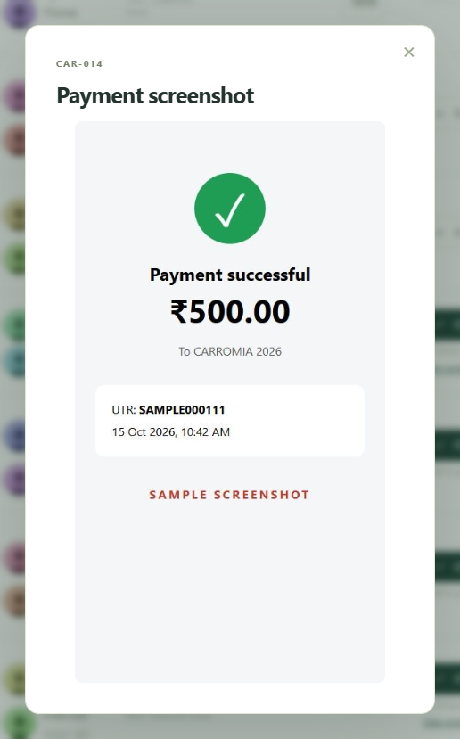 | 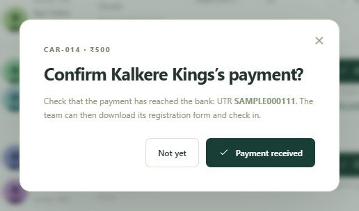 | 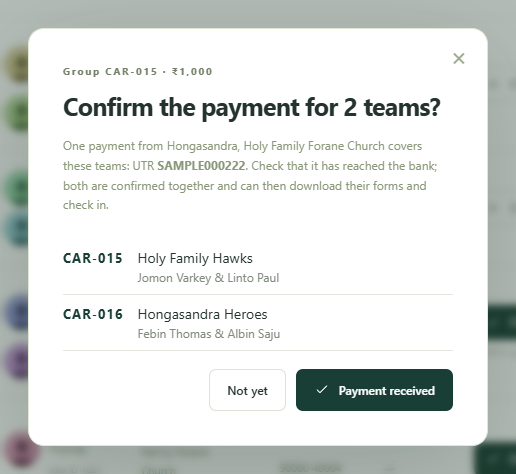 |

Then press the team's **WhatsApp** button. It opens WhatsApp with a message to the primary player, or for a group to the parish coordinator, with a link to download the form. **PDF** downloads the form at the desk, for example to print a spare copy.

**Player photos:** tap a photo to see it full size, for example to compare with the player at check-in.

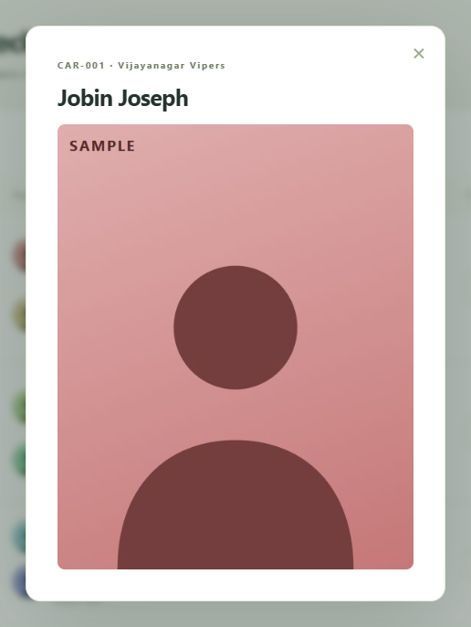

### 7.2 Checking teams in

**From the list:** press **Check in** on the team's row. It turns to **Checked in**. Press again to take the check-in back. That isn't allowed while the team is on a board.

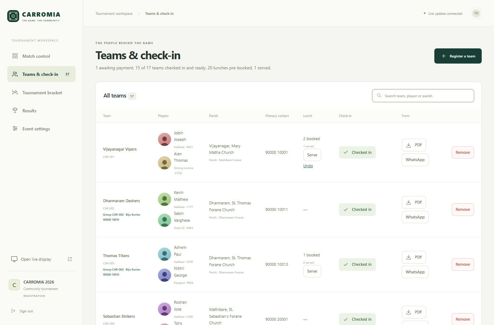

**By QR code:** scan the QR code on the team's form or phone with any camera. This opens **QR check-in** for that team, with large photos and ID details.

1. Compare each player's face and ID proof, and check the **attested registration form**.
2. Press **Confirm team check-in**.

Scanning alone never checks a team in. A team whose payment is still pending can't be checked in.

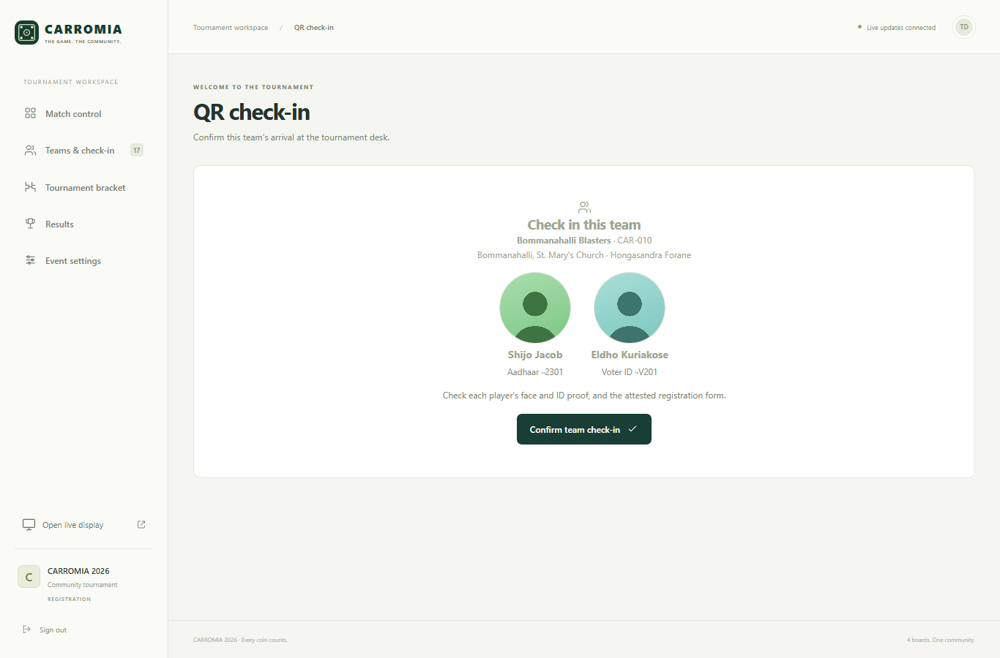

### 7.3 Running a match

**Match control** is the home of the desk. It shows:

- **Stats:** teams registered and checked in, boards in use, matches completed, and the match format.
- **The boards:** four cards showing each board's state.
- **Match queue:** *Up next* shows every match waiting. *Ready to play* shows only the ones that can go on a board now.
- **From the desk:** the latest activity.

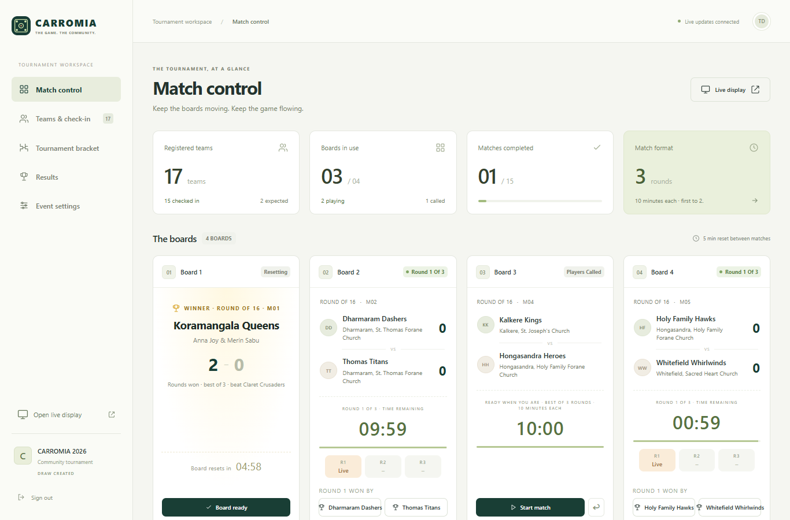

**Queue labels:**

| Label | Meaning |
|---|---|
| **Ready** | Both teams are checked in and free. It can be assigned. |
| **Awaiting check-in** | One or both teams haven't checked in. |
| **Team on another board** | A team is still playing elsewhere. |
| **Rest period** | A team's rest time after its last match hasn't passed yet. |

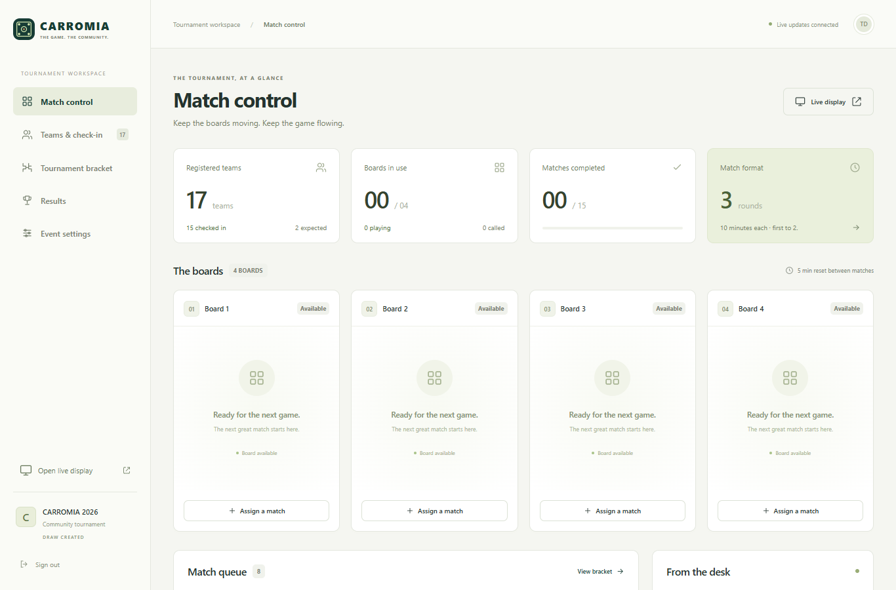

**A board's life:**

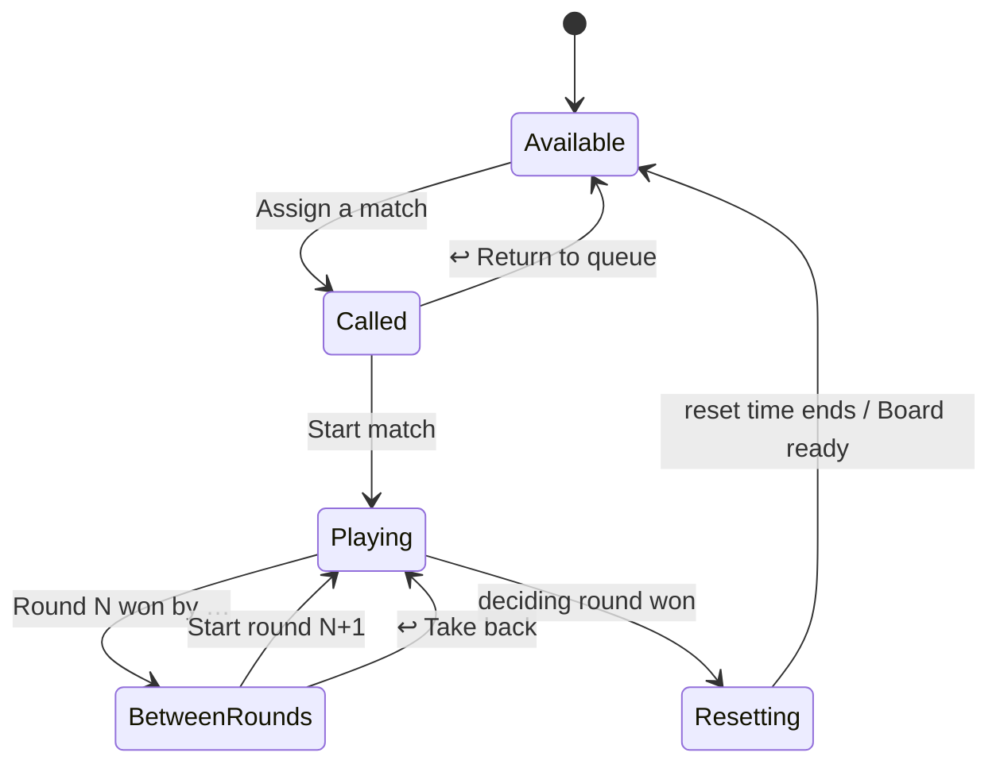
```mermaid
stateDiagram-v2
  [*] --> Available
  Available --> Called: Assign a match
  Called --> Available: ↩ Return to queue
  Called --> Playing: Start match
  Playing --> BetweenRounds: Round N won by …
  BetweenRounds --> Playing: Start round N+1
  BetweenRounds --> Playing: ↩ Take back
  Playing --> Resetting: deciding round won
  Resetting --> Available: reset time ends / Board ready
```

**Step by step:**

1. **Assign.** Press **Assign a match** on a free board, or **Assign →** on a queued match. Choose the match and board, then press **Call teams to board**. The board shows *Players called*, and the live display asks the teams to report. **↩** sends a called match back to the queue.
2. **Start.** When both teams are seated, press **Start match**. Round 1's timer starts.
3. **Mark each round.** The umpire decides each round, whether or not its time is up. Under **Round N won by**, press the winning team, then confirm. When the timer reaches zero, the board shows *Round time up · Umpire deciding*. It does not end the round by itself.
4. **Next round.** Players change seats. Press **Start round N**.
5. **Take back** a mis-tap with **↩**. The round goes back into play on its own timer.
6. **Match won.** When a team wins most of the rounds (2 of 3 by default), confirm **Confirm and end match**. The winner advances in the bracket, and the board shows the winner while it **resets**.
7. **Board ready.** Once the board is set up again, press **Board ready** to make it available before the reset time runs out.

| 1. Assign | 2. Called | 3. Playing |
|---|---|---|
| 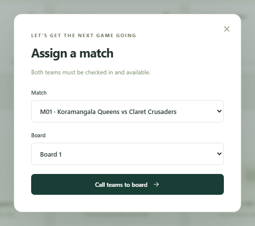 | 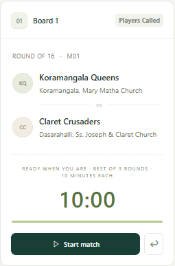 | 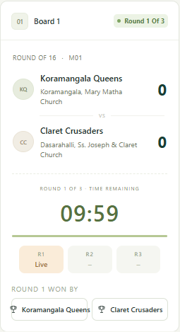 |

| Confirm a round winner | Between rounds | Take back a round |
|---|---|---|
| 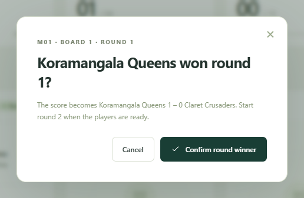 | 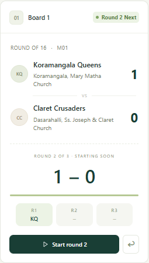 | 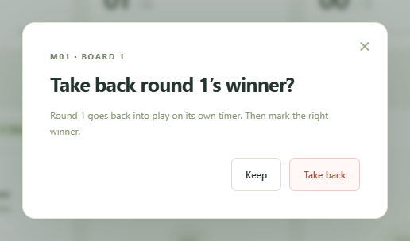 |

| Round 2 in play | Deciding round ends the match | Resetting, with the winner |
|---|---|---|
| 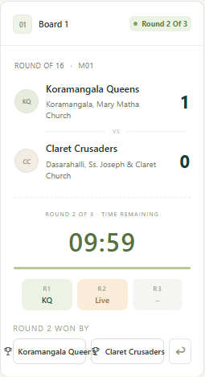 | 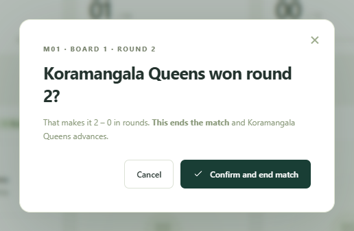 | 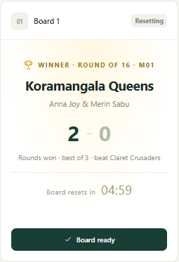 |

When the round timer runs out:

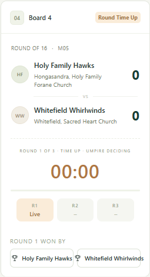

Full match control page

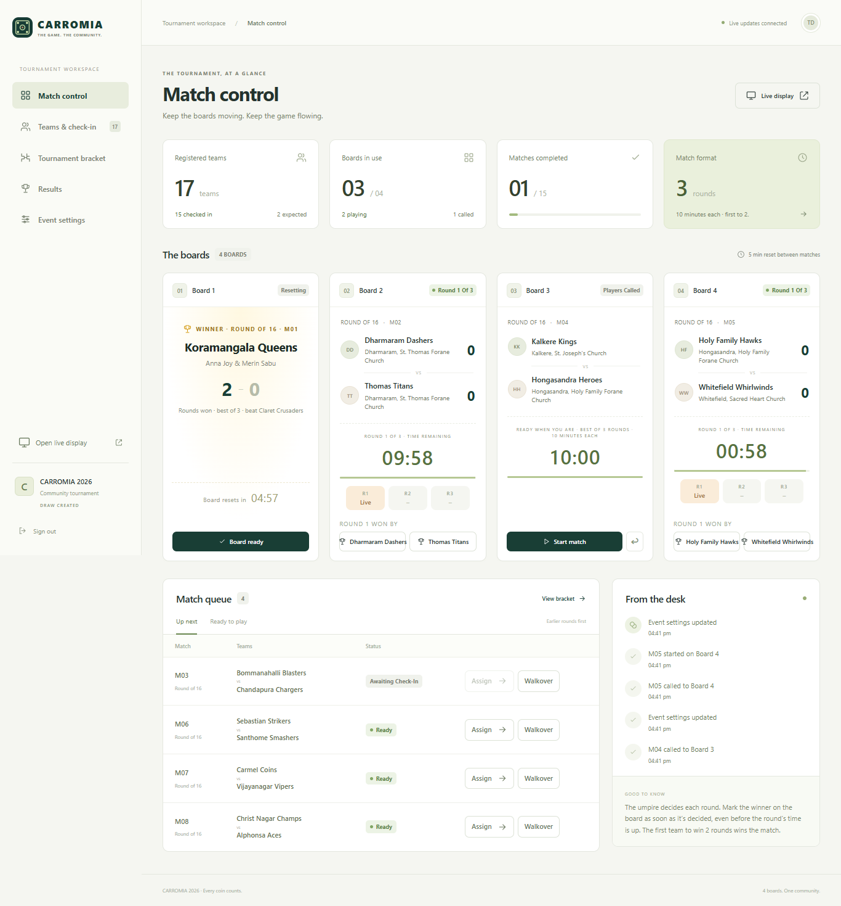

### 7.4 Bracket and results

**Tournament bracket** shows every round. Winners are highlighted, and the champion appears at the end. Scroll sideways on small screens.

| In progress | Complete |
|---|---|
| 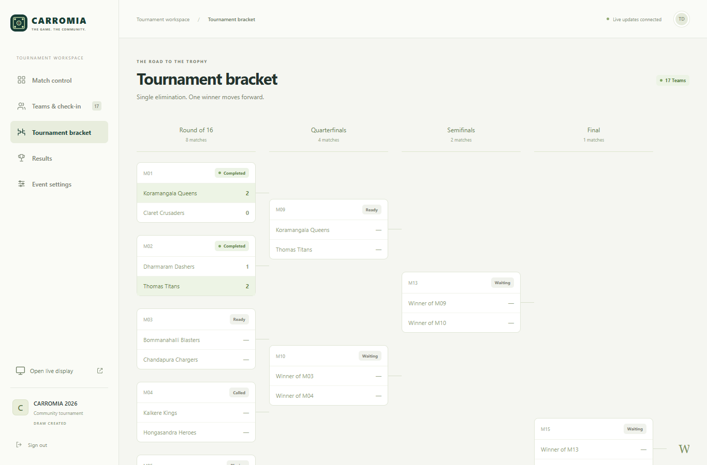 | 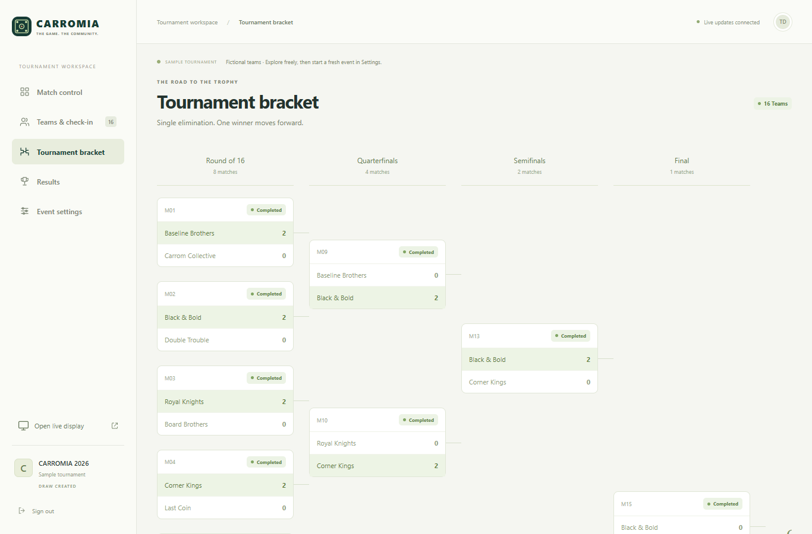 |

**Results** lists every finished match, newest first. It shows the score in rounds, the winner, the time, and who recorded it. **Export results** downloads them as a JSON file. Officials see the same table without the admin-only **Correct** and **Undo walkover** buttons.

### 7.5 What an official's desk looks like

An official's menu has everything but **Officials**. In the queue there's **Assign** but no **Walkover**, and the team list has no **Remove**.

| Match control (official) | Teams (official) |
|---|---|
| 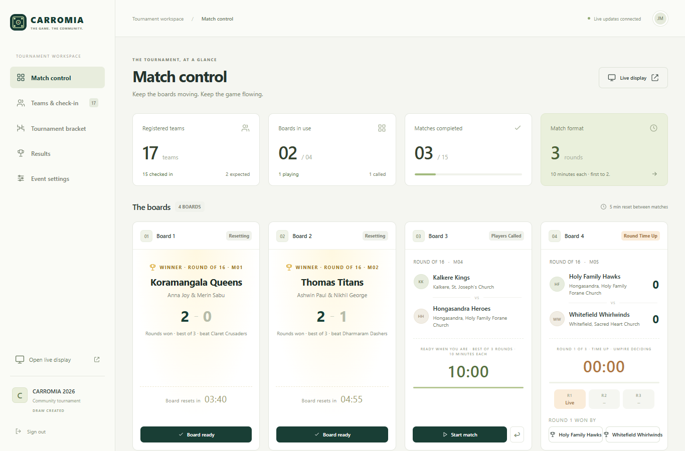 | 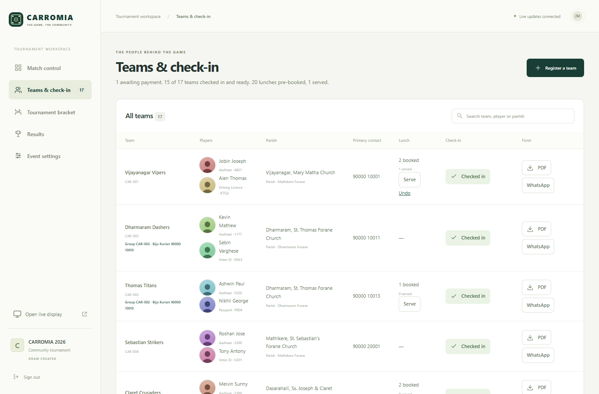 |

---

## 8. Check-in desk guide

*For the **Check-in desk** role. Admins and officials can do the same.*

After signing in you see one page, **Check-in**. It shows how many teams are checked in, and the team list with **photos and ID details only**. There are no phone numbers or payment details.

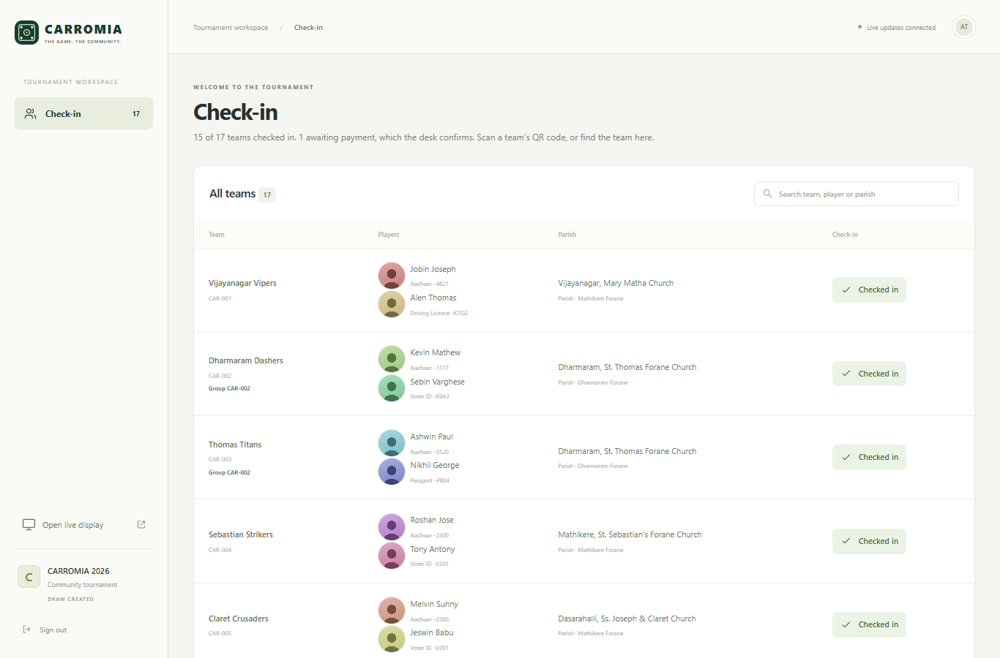

**Checking a team in:**

1. Ask for the team's **registration form**, printed and attested with the parish seal, and each player's **ID proof**.
2. **Scan the QR code** on the form with the phone's camera, or search for the team by name or ID in the list.
3. The **QR check-in** page shows both players' photos, names and ID type with its last 4 characters. Compare them with the people and IDs in front of you.
4. Press **Confirm team check-in**. You'll see *"Team checked in. Welcome to CARROMIA!"*

| QR check-in on a phone | Team still awaiting payment |
|---|---|
| 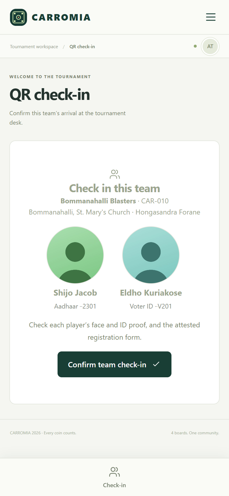 | 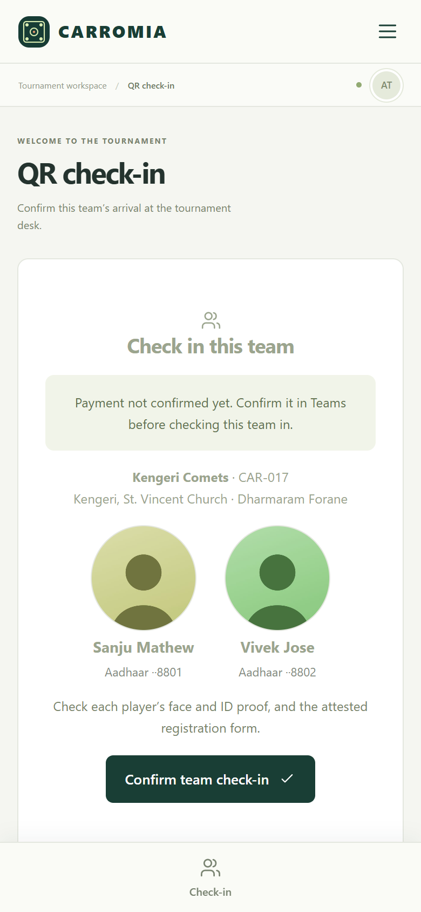 |

- **Awaiting payment** means the desk hasn't confirmed the team's payment. Send the team to an official. You can't confirm payments.
- To **take a check-in back**, press **Checked in** in the list. This isn't possible while the team is on a board.
- If a player, their ID or the attested form doesn't match, **don't check the team in**. Call an official.

---

## 9. Lunch counter guide

*For the **Lunch counter** role. Admins and officials can do the same. Needs **Lunch coupons** turned on in Event settings.*

After signing in you see one page, **Lunch**. It shows how many booked lunches have been served, and the team list with names only.

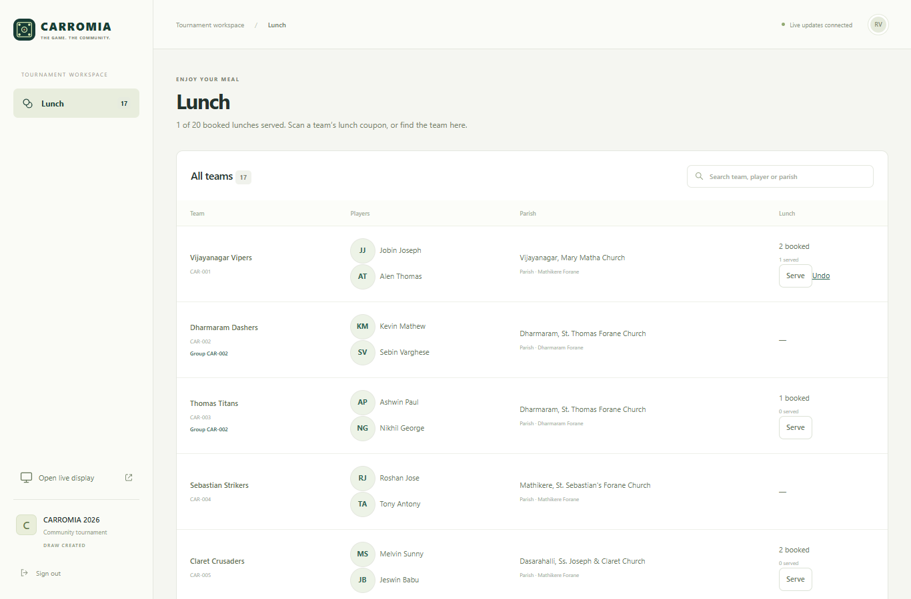

**Serving a lunch:**

1. **Scan the lunch coupon** (at the bottom of the team's form) with the phone's camera. The **Lunch counter** page opens for that team.
2. It shows how many lunches are served out of those booked. Press **Serve 1 lunch** or **Serve both lunches**.
3. Each coupon can be used once. When everything is served, the page says so.

| Coupon scanned | Lunch served | Coupon not recognised |
|---|---|---|
| 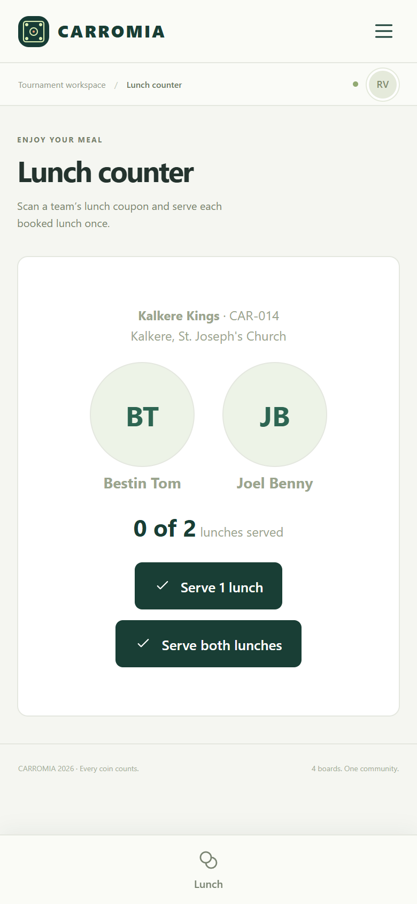 | 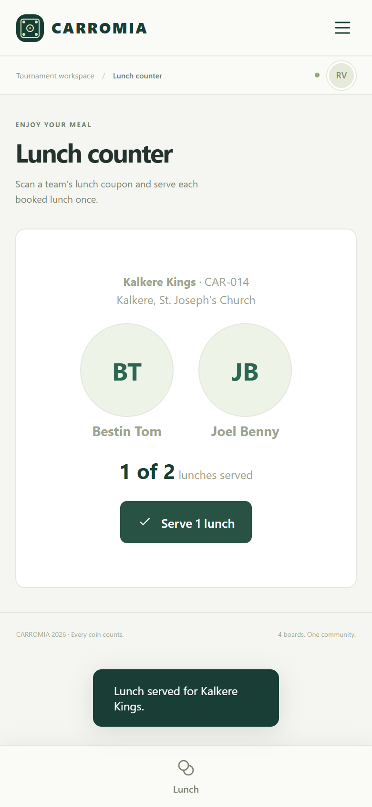 | 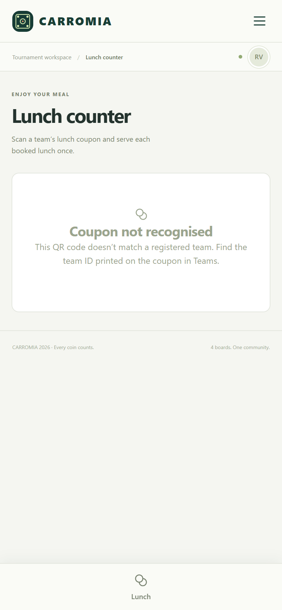 |

- **Without a coupon:** find the team in the list and press **Serve**.
- **Served by mistake:** press **Undo** in the list.
- **Messages:**
  - *No lunch was booked for this team* — lunch wasn't booked at registration.
  - *Payment not confirmed yet* — send the team to an official.
  - *Every lunch booked for this team has already been served*
  - *Lunch coupons are turned off* — ask an admin.

With coupons turned on, the admin's and officials' team list also shows **Serve** and **Undo** in the Lunch column.

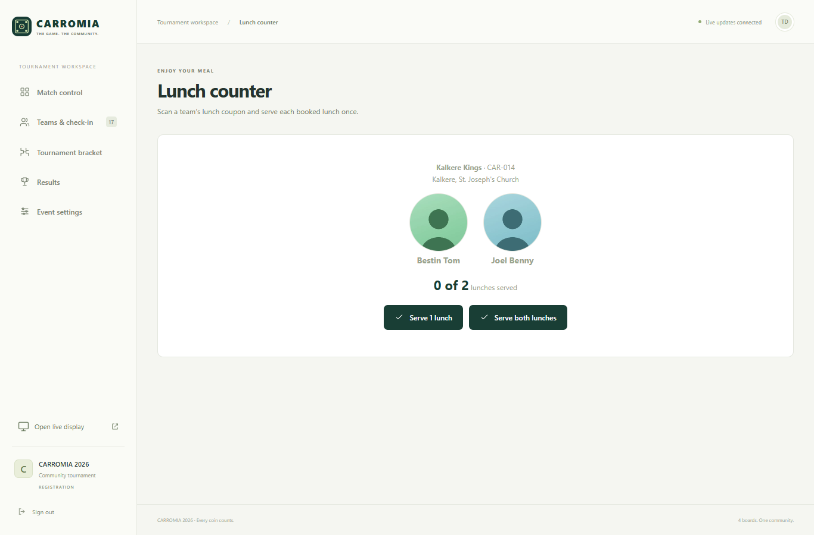

---

## 10. Umpire guide

*For the **Umpire** role. An admin gives you one or more boards, and you see and control only those.*

After signing in you see **My boards**. The desk **calls** each match to your board. Then you run it:

1. **Players called**: when both teams are seated, press **Start match**. The round timer starts.
2. **During a round**, the timer counts down. You decide the round, whether or not the time is up. Under **Round N won by**, tap the winning team, then **Confirm round winner**.
3. **Between rounds**, players change seats. Tap **Start round N**.
4. **Mistake?** Tap **↩** to take back the last round's winner. That round goes back into play.
5. When a team has won most of the rounds (2 of 3 by default), confirm **Confirm and end match**. The board shows the winner and starts its **reset** time.
6. After resetting the coins and board, tap **Board ready**. The desk can then call the next match.

| Your boards (desktop) | Called match (phone) |
|---|---|
| 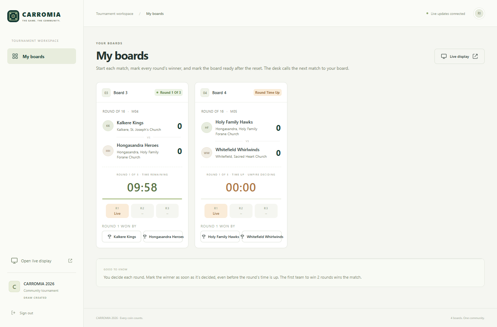 | 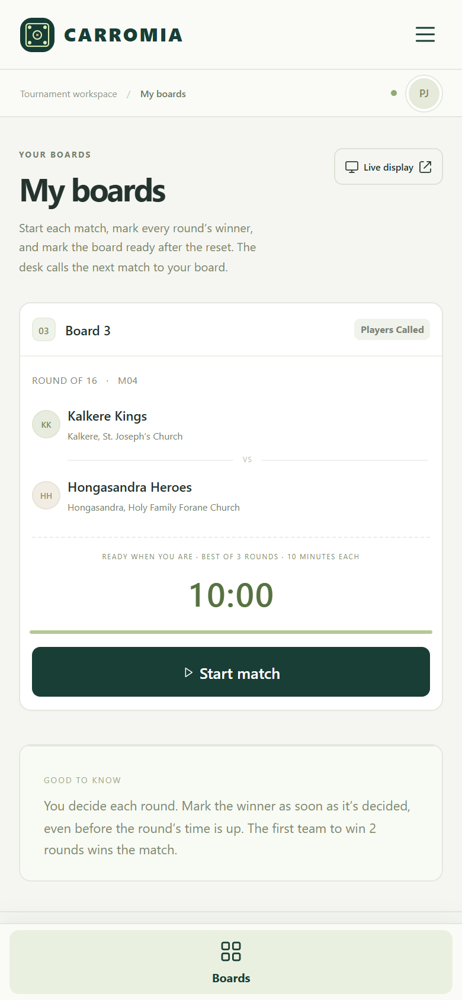 |

| Round in play (phone) | Waiting for the desk (phone) | Your role in the menu |
|---|---|---|
| 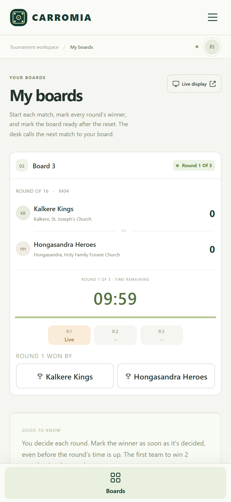 | 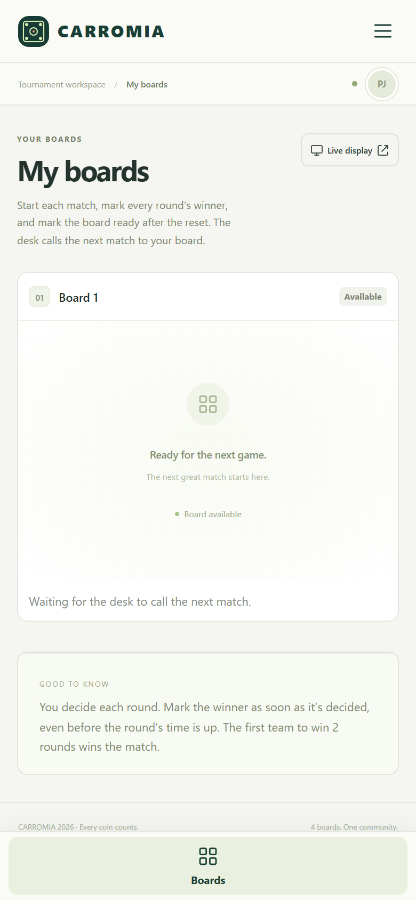 | 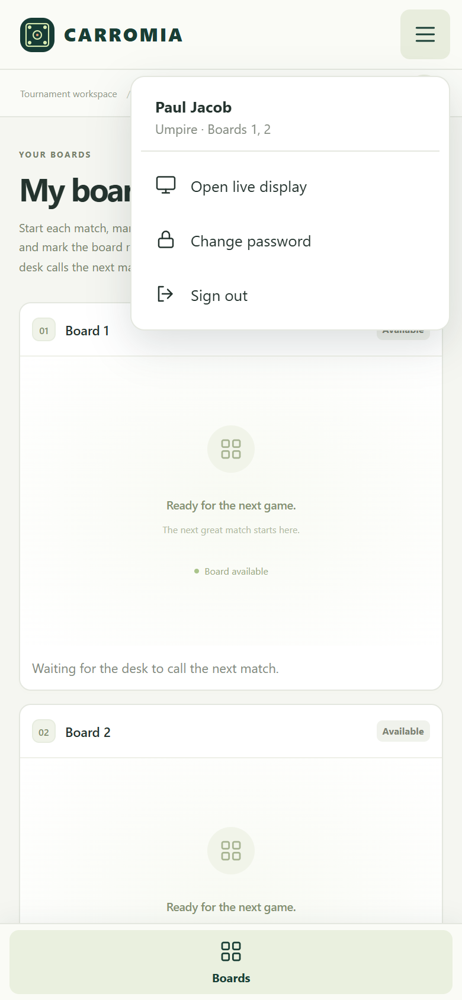 |

- **You can't** call matches to your board, send them back to the queue, or touch other boards. *"Waiting for the desk to call the next match."* means the desk will assign the next one.
- **No boards shown?** Ask the event admin to assign your boards in **Officials**.
- **Wrong result after the match ended?** Tell an admin. They can **Correct** it until the winner's next match is called.

---

## 11. The live display and public results

Open **Live boards** (`/live`) on a TV or projector. From the desk, use **Open live display**. The page:

- shows all four boards with teams, parishes, the round in play, the round timer, and rounds won,
- shows *Players called · Teams, please report to this board* for called matches,
- shows the winner while a board resets,
- lists **Up next**: the next matches, with a note for teams still awaiting check-in,
- has a **Scan for results** QR code that opens the results page on phones. On phone-sized screens it becomes an **Open live results** button,
- shows **LIVE TOURNAMENT**, or **PRACTICE** in practice mode, and the connection status.

It updates by itself. There's nothing to press.

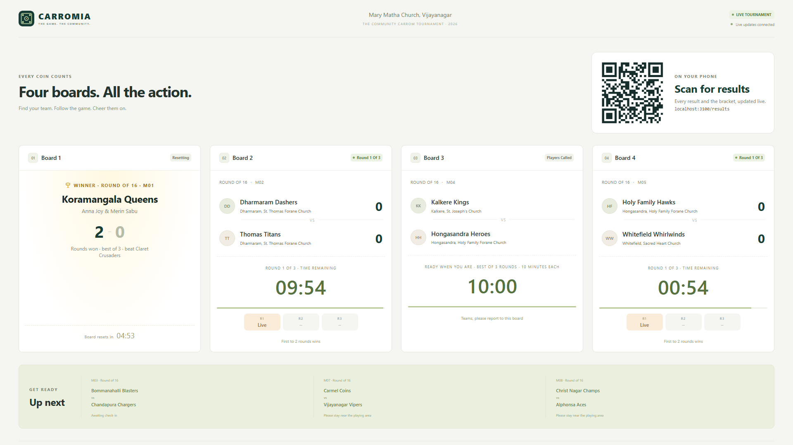

| Round time up | Champion |
|---|---|
|  | 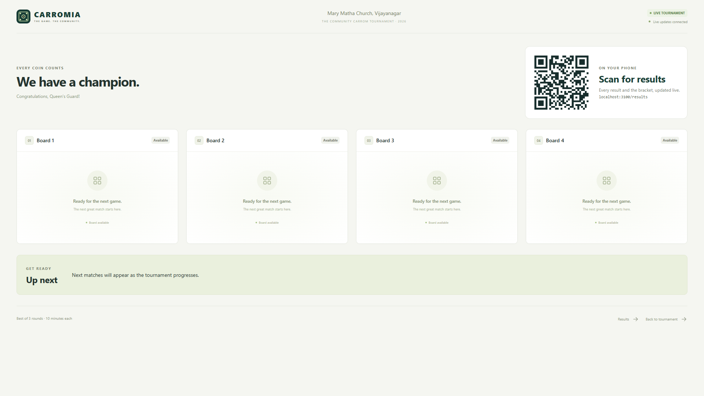 |

**Tips for the TV**

- Use full-screen (F11) in a browser that stays awake. Keep the tab in front. Hidden tabs pause their live connection and catch up when shown again.
- If the connection label shows *Reconnecting*, check the Wi-Fi. The page catches up by itself.

---

## 12. Practice mode

*Live site only.* Practice mode is a **separate rehearsal tournament**. Use it to train officials and volunteers without touching real registrations. The public site keeps showing the real event.

**Opening practice mode:** an admin or official goes to **Event settings → Practice mode → Open practice mode**. Any device can also follow practice mode: open a practice link (it contains `?practice=1`), or press **Switch to practice mode** at the bottom of the live display. A yellow **PRACTICE MODE** banner appears on every page of that device until someone taps **Exit practice**.

| Practice panel (real event, admin) | Desk in practice mode |
|---|---|
| 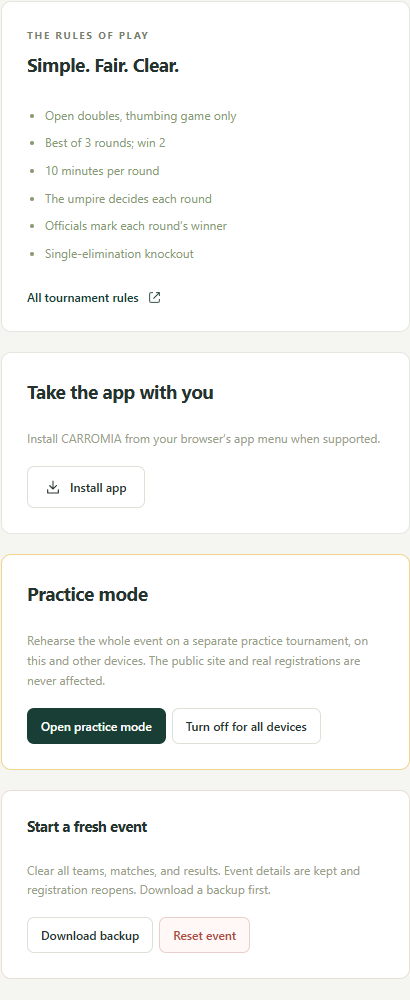 | 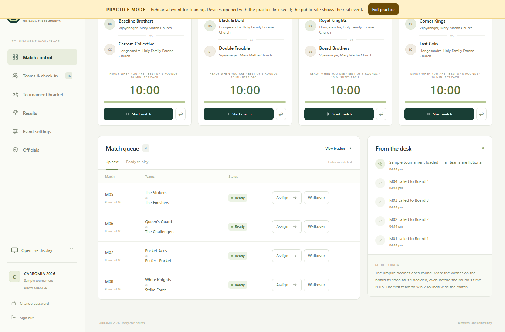 |

**While in practice**, the panel shows **links and QR codes** to open on other devices:

- **TV / big screen**: live boards
- **Phones: registration**: players register practice teams
- **Official phones: desk**: sign in, then check in, start and score

It also has two ways to start over:

- **Start empty practice (registration open)** runs the full flow: register → pay → check in → draw → play.
- **Load sample tournament** gives a ready-made draw.

| Practice links | Live display in practice |
|---|---|
| 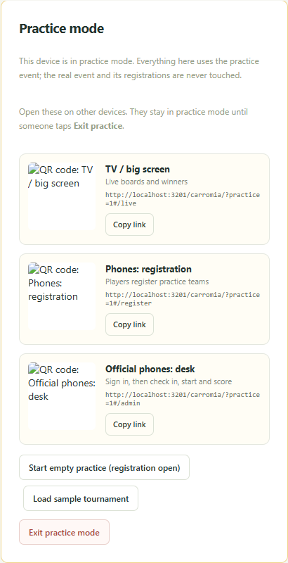 | 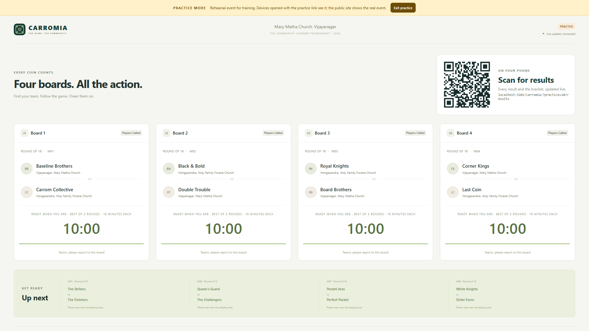 |

- In practice, **officials** may try every admin action. Check-in, lunch and umpire accounts still do only their job.
- The registration deadline doesn't apply in practice.
- **Turn off for all devices** (admins, from the real event) sends every device back to the real event and makes practice links open the real event. Practice data is kept, and **Turn practice mode back on** restores it.

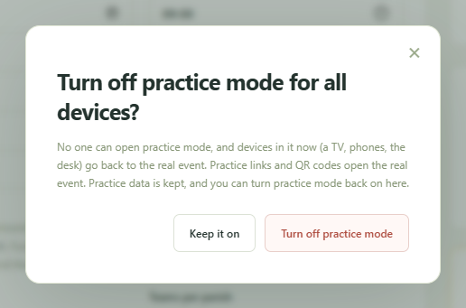

---

## 13. Troubleshooting and FAQ

### Common messages

| Message | What it means / what to do |
|---|---|
| **Awaiting check-in** (queue) | Check in both teams first. |
| **Team on another board** / **Rest period** (queue) | Wait. The match becomes *Ready* by itself. |
| *All boards are occupied or resetting.* | Finish a match, or press **Board ready** on a board that's set up. |
| *This board is being reset.* | Press **Board ready**, or wait for the reset timer. |
| *Payment for this team hasn't been confirmed yet.* | An official confirms the payment in **Teams** first. |
| *This team is assigned to a board.* | You can't take back the check-in of a team that's playing. |
| *Only an event admin can do this.* | Ask an admin. The draw, walkovers, corrections, settings, removal and reset are admin jobs. |
| *This isn't part of the … role.* / *This board isn't assigned to you.* | Your role doesn't cover this action. Ask an official or admin. |
| *Start round N first.* | The previous round is decided. Press **Start round N** before marking a winner. |
| *M07 has already been played, so this result can no longer be changed.* | A correction is too late: the winner's next match has started. |
| *Teams can't be removed after the draw is created.* | Use a **walkover** instead. |
| *Registration is closed for this draw.* / *Registration closed on …* / *All 64 team slots are taken.* | Registration is closed. An admin can change the limits in Settings before the draw. |
| *… already has 4 teams registered, the most allowed for one parish.* | That parish has reached its limit. |
| *That mobile number doesn't match this team's primary contact or parish coordinator.* | Use the number given at registration, as the last 10 digits. |
| *Too many tries. Try again …* | Too many wrong mobile numbers, or sign-in attempts. Wait and try again. |
| *Sample tournament is active…* | Local server: start a fresh event before taking real registrations. |
| *Officials management isn't set up yet…* | The `officials` server function isn't deployed. See Appendix A. |
| *Reconnecting — data may be outdated* | The connection dropped. The page retries by itself; check the Wi-Fi. |
| *Unable to reach the tournament* | No internet. Press **Try again**. |

### FAQ

- **A team lost its form.** Open **Teams** on the public site, find the team, and enter the primary player's mobile. Or an official presses **PDF** or **WhatsApp** in the desk.
- **A player changed.** The desk can't edit a team. Before the draw, an admin removes the team and it registers again (it gets a new ID). After the draw, decide as a committee.
- **Can two officials work at once?** Yes. Every screen updates within a second or two. If two people change the same thing at the same moment, the live site retries automatically.
- **The round timer hit 00:00.** Nothing happens automatically. The umpire decides the round, and someone marks the winner.
- **Rules or prizes on the site need changing.** The event name, date, fee and limits are in Event settings. The prizes, timetable, Mass times, documents and rule text are in the site's content file (`public/info.js`) and need a site update.
- **Install as an app.** Event settings → **Install app**, or your browser's menu → *Install app* / *Add to Home Screen*.

---

## Appendix A — One-time setup checklist for admins

The full technical steps are in the project's [README](../README.md). In short:

1. Run the database migrations in `supabase/migrations/`, in order, in the Supabase SQL Editor.
2. Deploy the two server functions, **`registration`** (required) and **`officials`** (for the Officials page). Turn off *Enforce JWT verification* on both.
3. Create the **first admin**: Supabase → Authentication → Add user, then add them to `public.officials` with role `admin`. The README has the SQL. Every other official can then be added from the **Officials** page.
4. Command-line alternative: `npm run add-official -- email "Name" role [boards]`, for example `npm run add-official -- uma@example.org "Uma Umpire" umpire 1,2`.
5. Recommended: in Supabase, turn off *Allow new users to sign up*, so only the accounts you create exist.
6. In **Event settings**: check the details, set up UPI and lunch coupons, add the support contacts.
7. **Rehearse** the whole day in practice mode with the actual phones and TV.

## Appendix B — Audit log and data

- **Audit log:** every sign-in, registration, desk action (with the official's name and details), officials change and password change is recorded in the `audit_log` table in the Supabase dashboard. The app has no screen for it. The **From the desk** panel on Match control shows the latest few activity messages of the event.
- **Private data:** mobile numbers, ID details, photos and payment screenshots are visible only to the roles listed in [section 2](#2-roles-and-permissions). The public pages show team names, player names and parishes only.
- **Backups:** Event settings → **Download backup** (admin). The file contains contact details, so store it privately.

## Appendix C — Quick reference cards

**Check-in desk:** scan the QR code → compare faces, IDs and the attested form → **Confirm team check-in**. *Awaiting payment* → send the team to an official.

**Lunch counter:** scan the coupon → **Serve 1 lunch** / **Serve both lunches**. A mistake → **Undo** in the list.

**Umpire:** **Start match** → *Round N won by* → confirm → **Start round N** → … → **Confirm and end match** → reset the board → **Board ready**. ↩ takes back a mis-tap.

**Official:** confirm payments → WhatsApp the forms → check in → **Assign** matches to free boards → run the boards → watch the queue labels.

**Admin:** settings → officials → rehearse → check the team list → **Create knockout draw** → walkovers and corrections as needed → export results → download a backup.

## Streams & gallery (event admins)

Open **Streams & gallery** in the desk menu (on phones, under More options). Both displays start disabled.

1. To show broadcasts beside board scores, tick **Show board streams on Live boards** and save. Add a specific YouTube or Facebook broadcast link to each board, tick **Show this stream**, and save that board. The link stays with the board as matches change. A match stream overrides the board stream while that match is called or playing; unticking its visibility hides the stream for that match, and removing its link restores the board stream. Missing links leave a board as usual.
2. Broadcast from the platform's app or your streaming equipment. The tournament site displays the broadcast; it does not start or upload it. Instagram live links open externally. Use public content with embedding allowed; viewers can use **Open stream** if a player cannot load.
3. Enable the **public photo & video wall** and save. Add a public social post/video URL, title and type under **Add a gallery link**. It enters the review list as **pending**.
4. Use **Review original** to check the content. **Approve** publishes it on Gallery. **Hide / pending** or **Reject** removes it from public view; **Remove** deletes the saved link. Visitors never receive pending or rejected links.
5. Preview Live boards or Gallery using the links at the top. Global switches hide the displays without deleting saved links. Changes update other devices automatically. Practice mode has its own media links; a fresh event clears them.

The public Gallery appears in navigation when enabled. It contains only links added and approved by admins; it does not automatically import everything from social accounts.
